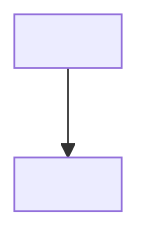
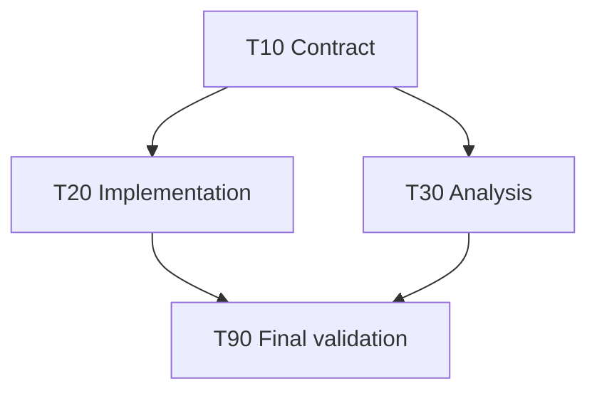

# <Plan title>

このファイルを実行計画と進捗のsource of truthとする。main Codexだけがstatus、decision log、完了判定を更新する。

## Goal

<実装後に成立する状態>

## Scope

### In

- <含める変更>

### Out

- <含めない変更>

## Verified context

| Path / source | Confirmed fact | Plan impact |
| --- | --- | --- |
| `<path>` | <確認した事実> | <設計・taskへの影響> |

## Design

- <採用する設計と境界>
- <shared contract / data flow / state ownership>
- <移行・rollback方針があれば記載>

## Status board

| Task | Status | Owner | Model / reasoning | Depends on | Integration batch | Summary |
| --- | --- | --- | --- | --- | --- | --- |
| T10 | not_started | main-codex | inherited | [] | B1 | <contract task> |
| T20 | not_started | cursor-cli-agent | composer-2.5-fast / fixed | [T10] | B2 | <local implementation> |
| T30 | not_started | codex-subagent | gpt-5.6-terra / medium | [T10] | B2 | <analysis or complex task> |
| T90 | not_started | main-codex | inherited | [T20, T30] | B9 | final integration and validation |

Status: `not_started | ready | running | needs_review | done | blocked | deferred`

## Task graph

## Conflict and integration

| Batch | Tasks | Conflict / barrier | Main acceptance |
| --- | --- | --- | --- |
| B1 | T10 | downstream contractを先に固定 | <check> |
| B2 | T20, T30 | write scopeが重ならないこと | <combined check> |
| B9 | T90 | required task完了後 | <final checks> |

## Task contracts

### T10: <title>

- Status: `not_started`
- Owner: `main-codex`
- Model / reasoning: `inherited`
- Mode: `edit | read-only`
- Depends on: `[]`
- Goal: <このtaskが成立させる状態>
- Read scope: `<paths>`
- Write scope: `<paths | none>`
- Forbidden: `<paths / operations>`
- Constraints: <守るcontract>
- Acceptance: <観測可能な完了状態>
- Worker verification: `<command | none>`
- Main verification: `<command>`
- Final report: <必要な報告>

### T20: <title>

- Status: `not_started`
- Owner: `cursor-cli-agent`
- Model / reasoning: `composer-2.5-fast / fixed`
- Mode: `edit`
- Depends on: `[T10]`
- Goal: <このtaskが成立させる状態>
- Read scope: `<paths>`
- Write scope: `<paths>`
- Forbidden: `plan更新、commit、branch、remote、scope外変更`
- Constraints: <守るcontract>
- Acceptance: <観測可能な完了状態>
- Worker verification: `<focused command>`
- Main verification: `<acceptance command>`
- Final report: `TASK_ID / MODEL / changed files / verification / remaining work`

必要なtask contractだけを追加する。taskごとのprogress欄やReady/Blocked queueは作らない。

## Decision log

| ID | Date | Decision | Reason | Impact |
| --- | --- | --- | --- | --- |
| D001 | <YYYY-MM-DD> | <決定> | <理由> | <task / contractへの影響> |

## Completion criteria

- [ ] required taskが`done`、または理由付きで`deferred`
- [ ] integration batchのacceptanceが完了
- [ ] final typecheck / test / build / browser / dry-runの必要項目が成功
- [ ] scope外変更と未解決conflictがない

## Risks / deferred

- <残存リスク、後続task、停止条件>
