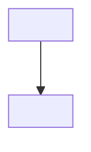
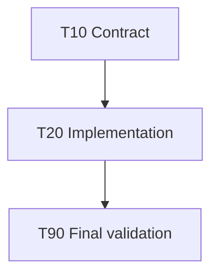

# <Plan title>

このファイルを実行計画と進捗のsource of truthとする。main Codexだけがstatus、decision log、完了判定を更新する。

## Planning policy

- Execution routing: `<policy_id from references/task-routing.json>`
- UI / UX contract: `required | not_applicable` — `<reason>`

## Goal

<実装後に成立する状態>

## Scope

### In

- <含める変更>

### Out

- <含めない変更>

## Verified context

| Path / source | Confirmed fact | Plan impact |
| --- | --- | --- |
| `<path>` | <確認した事実> | <設計・taskへの影響> |

## Design

- <main Codexが決定した設計と境界>
- <shared contract / data flow / state ownership>
- <移行・rollback方針があれば記載>

```mermaid
flowchart TD
  A["<source>"] --> B["<boundary>"]
```

## UI / UX contract

UI影響がある場合だけ残す。UI影響がない場合はPlanning policyを`not_applicable`とし、この節を削除する。

| Surface | User goal / main flow | Existing pattern / design system | States / feedback | Interaction / accessibility | Verification |
| --- | --- | --- | --- | --- | --- |
| `<surface>` | `<goal and flow>` | `<existing component / convention>` | `<relevant states and recovery>` | `<input, focus, semantics>` | `<tests / browser / visual check>` |

- Reference UI: `<path / URL and intentional differences | none>`
- Product-specific targets: `<viewport / theme / platform / evidence requirements | repository defaults>`

## Status board

| Task | Status | Work kind | Difficulty | Execution route | Owner | Model / reasoning | Depends on | Integration batch | Summary |
| --- | --- | --- | --- | --- | --- | --- | --- | --- | --- |
| T10 | not_started | design | high | main | main-codex | inherited | [] | B1 | <contract or architecture> |
| T20 | not_started | implementation | medium | cursor | cursor-cli-agent | composer-2.5-fast / fixed | [T10] | B2 | <bounded implementation> |
| T90 | not_started | integration | high | main | main-codex | inherited | [T20] | B9 | final integration and validation |

Status: `not_started | ready | running | needs_review | done | blocked | deferred`

Work kind: `design | implementation | support | integration | verification`

subagentが必要な場合だけ`support` taskを追加する。標準taskとして作らない。

## Task graph

```mermaid
flowchart TD
  T10["T10 Contract"] --> T20["T20 Implementation"]
  T20 --> T90["T90 Final validation"]
```

## Conflict and integration

| Batch | Tasks | Conflict / barrier | Main acceptance |
| --- | --- | --- | --- |
| B1 | T10 | downstream contractを先に固定 | <check> |
| B2 | T20 | workerのwrite scopeを分離 | <combined check> |
| B9 | T90 | required task完了後 | <final checks> |

## Task contracts

### T10: <title>

- Status: `not_started`
- Work kind: `design`
- Difficulty: `high`
- Execution route: `main`
- Route reason: `<main ownership boundary>`
- Owner: `main-codex`
- Model / reasoning: `inherited`
- Mode: `edit | read-only`
- Depends on: `[]`
- Goal: <このtaskが成立させる状態>
- Read scope: `<paths>`
- Write scope: `<paths | none>`
- Forbidden: `<paths / operations>`
- Constraints: <守るcontract>
- UI / UX: `<surface / flow / states / interaction / verification | not_applicable>`
- Acceptance: <観測可能な完了状態>
- Worker verification: `none`
- Main verification: `<command>`
- Final report: <必要な報告>

### T20: <title>

- Status: `not_started`
- Work kind: `implementation`
- Difficulty: `low | medium`
- Execution route: `cursor`
- Route reason: `<task type and every satisfied cursor condition>`
- Owner: `cursor-cli-agent`
- Model / reasoning: `composer-2.5-fast / fixed`
- Mode: `edit`
- Depends on: `[T10]`
- Goal: <このtaskが成立させる状態>
- Read scope: `<paths>`
- Write scope: `<separated paths>`
- Forbidden: `plan更新、commit、branch、remote、scope外変更`
- Fixed contract / reference: `<main decision / existing pattern / sample>`
- Constraints: <守るcontract>
- UI / UX: `<fixed local UI contract | not_applicable>`
- Acceptance: <観測可能な局所完了状態>
- Worker verification: `<focused command>`
- Main verification: `<acceptance command>`
- Final report: `TASK_ID / MODEL / changed files / verification / remaining work`

### Optional support task: <title>

許可用途に該当し、並列化・別context・独立比較に具体的な利益がある場合だけ追加する。

- Status: `not_started`
- Work kind: `support`
- Difficulty: `high | medium`
- Execution route: `support_subagent_high | support_subagent_medium`
- Route reason: `<allowed support type and concrete parallel/context-isolation benefit>`
- Owner: `codex-subagent`
- Model / reasoning: `<resolved from task-routing.json>`
- Mode: `read-only`
- Depends on: `<task ids>`
- Goal / question: <独立して答えられるbounded question>
- Read scope: `<paths / logs / sources>`
- Write scope: `none`
- Forbidden: `source変更、plan更新、commit、branch、remote、外部state変更`
- Constraints: <評価基準と前提>
- UI / UX: `<audit target | not_applicable>`
- Acceptance: `根拠、結論、不確実性、推奨を要約してmainへ返す`
- Worker verification: `<read-only checks | none>`
- Main verification: `<evidence review / comparison / command>`
- Final report: `TASK_ID / MODEL / REASONING_EFFORT / evidence / conclusion / uncertainty / recommendation`

必要なtask contractだけを追加する。小さな調査をsubagent taskとして水増ししない。taskごとのprogress欄やReady/Blocked queueは作らない。

## Decision log

| ID | Date | Decision | Reason | Impact |
| --- | --- | --- | --- | --- |
| D001 | <YYYY-MM-DD> | <決定> | <理由> | <task / contractへの影響> |

## Completion criteria

- [ ] required taskが`done`、または理由付きで`deferred`
- [ ] Cursor taskのdiffとfocused verificationをmainが検収
- [ ] support subagentの根拠をmainが検証し、採否をDecision logへ反映
- [ ] integration batchのacceptanceが完了
- [ ] final typecheck / test / build / browser / dry-runの必要項目が成功
- [ ] UI taskは定義したflow、状態、interaction/accessibility、visual verificationが完了
- [ ] scope外変更と未解決conflictがない

## Risks / deferred

- <残存リスク、後続task、停止条件>
