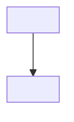
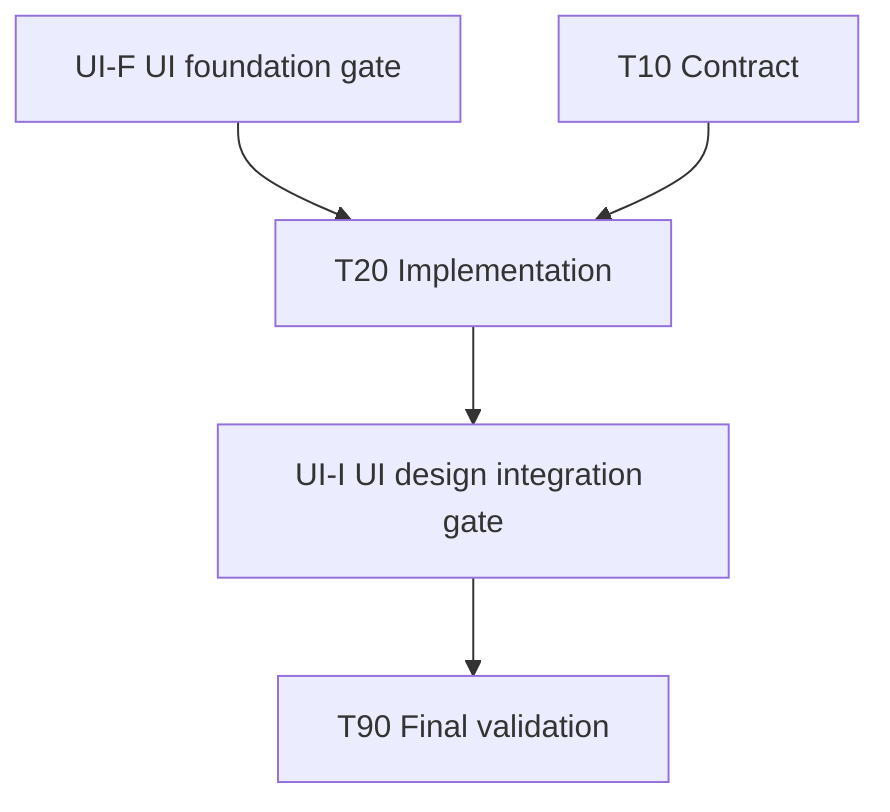

# <Plan title>

このファイルを実行計画と進捗のsource of truthとする。main Codexだけがstatus、decision log、完了判定を更新する。

## Planning policy

- Execution routing: `<policy_id from references/task-routing.json>`
- UI / UX contract: `required | not_applicable` — `<reason>`

## Goal

<実装後に成立する状態>

## Scope

### In

- <含める変更>

### Out

- <含めない変更>

## Verified context

| Path / source | Confirmed fact | Plan impact |
| --- | --- | --- |
| `<path>` | <確認した事実> | <設計・taskへの影響> |

## Design

- <main Codexが決定した設計と境界>
- <shared contract / data flow / state ownership>
- <移行・rollback方針があれば記載>


```mermaid
flowchart TD
  A["<source>"] --> B["<boundary>"]
```

## UI foundation

UI影響がある場合だけ残す。UI影響がない場合はPlanning policyを`not_applicable`とし、この節と`## Reference UI trace`を削除する。

**この節はUI-Fが埋める。行を削除しない。抽象語で埋めない。** 詳細は`references/ui-contract.md`。

### F1. Component mapping

| UI要素 | 使用component (import path) | 新規作成 |
| --- | --- | --- |
| `<button / select / input / dialog / alert / tabs …>` | `<path>` | `no` / `yes → <task>` |

### F2. Token allowlist

| 用途 | 許可token | 禁止 |
| --- | --- | --- |
| `<前景 / 背景 / 境界 / accent / success / warning / error / disabled>` | `<token>` | `<legacy token / 生palette / hardcoded hex,rgb,oklch>` |

### F3. 共通surface owner

| 共通surface | 内容 | 所有task | 利用task |
| --- | --- | --- | --- |
| primary / secondary / destructive action | `<component と見た目>` | `<task>` | `<tasks>` |
| error / refusal | | | |
| success / receipt / undo | | | |
| loading / empty / disabled | | | |
| 承認・確認surface | | | |

### F4. Label policy

- 表示禁止: `<内部ID / enum識別子 / schema field名 / 例外message原文>`
- 代替表現: `<人が読める名前 / 序数 / 要約文>`
- 診断情報の置き場所: `<data-* / title / 開発者panel | none>`

### F5. i18n

- 基盤: `<namespace と locale | none>`
- 対象: `<見出し / button / tooltip / aria-label / toast / empty / error / success / 承認 / receipt / undo>`
- 例外と理由: `<... | none>`
- test方針: `表示文言でassertしない。data-testid か role + 安定keyで参照する`

### F6. Layout / theme / density

- 新規surfaceの配置方針: `<panel内 / dialog / overlay / banner>`（既存repositoryの多数派pattern: `<...>`）
- 同時表示の上限と優先順位: `<...>`
- 対応theme: `<...>` / 対応viewport: `<...>` / 文字密度: `<...>`

### F7. Static scan commands

| # | 検出対象 | Command | 合格条件 |
| --- | --- | --- | --- |
| S1 | design system componentを使っていないUI file | `<command>` | 0件 or 記録済み例外 |
| S2 | 素の`<button> <select> <input> <textarea>`の新規追加 | `<command>` | 0件 or 記録済み例外 |
| S3 | token allowlist外の色指定 | `<command>` | 0件 |
| S4 | CSS frameworkが生成しないutility class | `<command>` | 0件 |
| S5 | 表示文字列の直書き | `<command>` | 0件 |

- 認めた例外: `<path + 理由 | none>`

### 意図的な差分

| 箇所 | 標準からの差分 | 理由 |
| --- | --- | --- |
| `<surface>` | `<差分>` | `<理由>` |

UI-I時点で未記録の差分は不合格として扱う。事後の追認をしない。

## Reference UI trace

参照UIがある場合だけ残す。**`## UI foundation`の規約をこの節で置き換えない。** 参照UIの操作・情報設計を写す先はここであり、component選定とtokenはUI foundationが決める。

| 参照元 | 踏襲する操作・情報 | 対応するOpenReel surface | 意図的に変えた点 | 担当task |
| --- | --- | --- | --- | --- |
| `<path / URL>` | `<...>` | `<surface>` | `<...>` | `<task>` |

## Status board

| Task | Status | Work kind | UI | Difficulty | Execution route | Owner | Model / reasoning | Depends on | Integration batch | Summary |
| --- | --- | --- | --- | --- | --- | --- | --- | --- | --- | --- |
| UI-F | not_started | design | foundation | high | main | main-codex | inherited | [] | B1 | UI foundation gate |
| T10 | not_started | design | - | high | main | main-codex | inherited | [] | B1 | <contract or architecture> |
| T20 | not_started | implementation | surface | medium | cursor | cursor-cli-agent | composer-2.5-fast / fixed | [T10, UI-F] | B2 | <bounded implementation> |
| UI-I | not_started | integration | integration | high | main | main-codex | inherited | [T20] | B9 | UI design integration gate |
| T90 | not_started | integration | - | high | main | main-codex | inherited | [T20, UI-I] | B9 | final integration and validation |

UI: `foundation | surface | integration | -`

`UI / UX contract: not_applicable`のplanでは`UI`列とUI-F / UI-I行を削除する。`required`のplanでは、UI実装taskが1つでもあればUI-FとUI-Iを必ず置き、省略しない。

Status: `not_started | ready | running | needs_review | done | blocked | deferred`

Work kind: `design | implementation | support | integration | verification`

subagentが必要な場合だけ`support` taskを追加する。標準taskとして作らない。

## Task graph


```mermaid
flowchart TD
  UIF["UI-F UI foundation gate"] --> T20["T20 Implementation"]
  T10["T10 Contract"] --> T20
  T20 --> UII["UI-I UI design integration gate"]
  UII --> T90["T90 Final validation"]
```

## Conflict and integration

| Batch | Tasks | Conflict / barrier | Main acceptance |
| --- | --- | --- | --- |
| B1 | T10 | downstream contractを先に固定 | <check> |
| B2 | T20 | workerのwrite scopeを分離 | <combined check> |
| B9 | T90 | required task完了後 | <final checks> |

## Task contracts

### UI-F: UI foundation gate

`UI / UX contract: required`の場合だけ置く。`not_applicable`なら削除する。

- Status: `not_started`
- Work kind: `design`
- UI: `foundation`
- Difficulty: `high`
- Execution route: `main`
- Route reason: `design system foundation — main ownership`
- Owner: `main-codex`
- Model / reasoning: `inherited`
- Mode: `edit`
- Depends on: `[]`
- Goal: 全UI実装taskが従うcomponent、token、共通surface、label、i18n、layout、static scanを具体値で確定する
- Read scope: `<design system / token定義 / 既存の代表surface / i18n定義>`
- Write scope: `<plan本体のUI foundation節>`（必要なら共通surface componentの新規作成pathも含める）
- Forbidden: `抽象語での記載、"既存design systemに従う"だけの記述、値未確定のままUI実装taskをreadyにすること`
- Constraints: 値はrepositoryを実際に読んで決める。既存の多数派patternを根拠付きで採用する
- Acceptance: `## UI foundation`のF1〜F7が具体値で埋まり、S1〜S5のcommandがmainの手元で実際に実行できる
- Worker verification: `none`
- Main verification: `S1〜S5を現行HEADへ実行し、command自体が動作することと既存件数のbaselineを記録する`
- Final report: 確定した値、既存baseline件数、意図的な差分として先に認めた項目

### UI-I: UI design integration gate

`UI / UX contract: required`の場合だけ置く。

- Status: `not_started`
- Work kind: `integration`
- UI: `integration`
- Difficulty: `high`
- Execution route: `main`
- Route reason: `cross-surface UI integration — main ownership`
- Owner: `main-codex`
- Model / reasoning: `inherited`
- Mode: `edit`
- Depends on: `<全UI実装task>`
- Goal: 全surfaceを並置して比較し、同一意味の要素が同一の見た目・構造であることを確認する
- Read scope: `<全UI変更範囲>`
- Write scope: `<planのUI-I結果 | 是正が必要な場合の対象path>`
- Forbidden: `surfaceを個別に確認して合格とすること、未記録の差分を事後に追認すること、statusをdeferredにすること`
- Constraints: I1の比較表を1つの表として作る。surfaceごとに節を分けない
- Acceptance: I1比較表の全軸が`yes`（または`## UI foundation`の意図的な差分へ事前記録済み）、I2同時表示、I3 theme/viewport、I4 scanがすべて合格
- Worker verification: `none`
- Main verification: `S1〜S5をUI変更範囲全体へ実行し0件（または記録済み例外のみ）を確認 + 横断比較表 + 同時表示 + 全theme/viewport`
- Final report: I1比較表、不一致箇所と是正内容、残存差分と根拠

不合格項目が残る間は`blocked`とし、planの完了判定を出さない。`done`か`blocked`のみで、`deferred`にしない。

### T10: <title>

- Status: `not_started`
- Work kind: `design`
- UI: `-`
- Difficulty: `high`
- Execution route: `main`
- Route reason: `<main ownership boundary>`
- Owner: `main-codex`
- Model / reasoning: `inherited`
- Mode: `edit | read-only`
- Depends on: `[]`
- Goal: <このtaskが成立させる状態>
- Read scope: `<paths>`
- Write scope: `<paths | none>`
- Forbidden: `<paths / operations>`
- Constraints: <守るcontract>
- Acceptance: <観測可能な完了状態>
- Worker verification: `none`
- Main verification: `<command>`
- Final report: <必要な報告>

### T20: <title>

- Status: `not_started`
- Work kind: `implementation`
- UI: `surface | -`
- Difficulty: `low | medium`
- Execution route: `cursor`
- Route reason: `<task type and every satisfied cursor condition>`
- Owner: `cursor-cli-agent`
- Model / reasoning: `composer-2.5-fast / fixed`
- Mode: `edit`
- Depends on: `[T10, UI-F]`
- Goal: <このtaskが成立させる状態>
- Read scope: `<paths>`
- Write scope: `<separated paths>`
- Forbidden: `plan更新、commit、branch、remote、scope外変更`
- Fixed contract / reference: `<main decision / existing pattern / sample>`
- Constraints: <守るcontract>
- Acceptance: <観測可能な局所完了状態>
- Worker verification: `<focused command>`
- Main verification: `<acceptance command>`
- Final report: `TASK_ID / MODEL / changed files / verification / remaining work`

`UI: surface`の場合、上の`Forbidden`と`Worker verification`と`Final report`へ次を**literalで追記する**。要約・言い換え・省略をしない。`UI: -`の場合は追記しない。

Forbidden追記:

```text
- UI foundation F1に対応componentがある要素を、素の<button> <select> <input> <textarea>や独自実装で新規に作ること
- UI foundation F2のallowlist外の色指定（生palette色、hardcoded hex/rgb/oklch、禁止側legacy token）
- UI foundation F3で他taskが所有すると決めた共通surfaceの再実装
- 利用者向けlabelへの内部ID、enum識別子、schema field名、例外message原文の直接表示
- 表示文字列の直書き（F5にi18n基盤がある場合）
- UI foundation F6で決めた配置方針から外れるsurfaceの新設
```

Worker verification追記:

```text
- UI foundation F7のS1〜S5を自分のwrite scopeへ実行し、結果を報告する
```

Final report追記:

```text
- 使用したcomponentとtokenの一覧
- S1〜S5の結果と、認めた例外があればpathと理由
- UI foundationから外れた箇所と、その理由
```

### Optional support task: <title>

許可用途に該当し、並列化・別context・独立比較に具体的な利益がある場合だけ追加する。

- Status: `not_started`
- Work kind: `support`
- UI: `-`
- Difficulty: `high | medium`
- Execution route: `support_subagent_high | support_subagent_medium`
- Route reason: `<allowed support type and concrete parallel/context-isolation benefit>`
- Owner: `codex-subagent`
- Model / reasoning: `<resolved from task-routing.json>`
- Mode: `read-only`
- Depends on: `<task ids>`
- Goal / question: <独立して答えられるbounded question>
- Read scope: `<paths / logs / sources>`
- Write scope: `none`
- Forbidden: `source変更、plan更新、commit、branch、remote、外部state変更`
- Constraints: <評価基準と前提>
- Acceptance: `根拠、結論、不確実性、推奨を要約してmainへ返す`
- Worker verification: `<read-only checks | none>`
- Main verification: `<evidence review / comparison / command>`
- Final report: `TASK_ID / MODEL / REASONING_EFFORT / evidence / conclusion / uncertainty / recommendation`

必要なtask contractだけを追加する。小さな調査をsubagent taskとして水増ししない。taskごとのprogress欄やReady/Blocked queueは作らない。

## Decision log

| ID | Date | Decision | Reason | Impact |
| --- | --- | --- | --- | --- |
| D001 | <YYYY-MM-DD> | <決定> | <理由> | <task / contractへの影響> |

## Completion criteria

- [ ] required taskが`done`、または理由付きで`deferred`
- [ ] Cursor taskのdiffとfocused verificationをmainが検収
- [ ] support subagentの根拠をmainが検証し、採否をDecision logへ反映
- [ ] integration batchのacceptanceが完了
- [ ] final typecheck / test / build / browser / dry-runの必要項目が成功
- [ ] scope外変更と未解決conflictがない

`UI / UX contract: required`の場合、次も必須。1つでも欠ければplanを完了としない。

- [ ] UI-Fが`done`で、`## UI foundation`のF1〜F7が具体値で埋まっている
- [ ] 全`UI: surface` taskで固定Forbidden blockが転記され、S1〜S5が報告されている
- [ ] UI-Iが`done`（`deferred`不可）。I1横断比較表の全軸が一致、I2同時表示、I3全theme/viewport、I4全体scanが合格
- [ ] 標準から外れた箇所がすべて`## UI foundation`の意図的な差分へ**事前に**記録されている

## Risks / deferred

- <残存リスク、後続task、停止条件>
