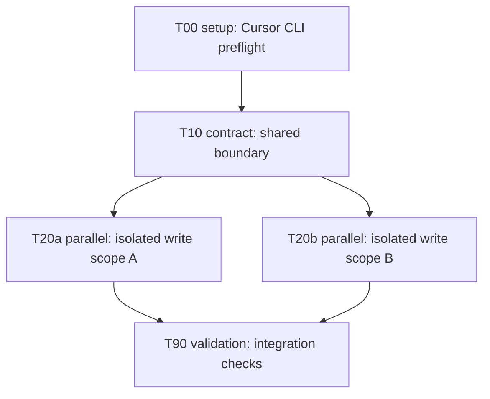
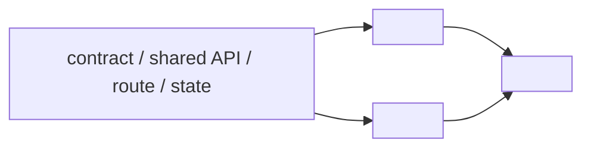

# Task 一覧

## 状態一覧

| Task | 状態 | 担当 | 種別 | 依存 | 並列グループ | 統合バッチ | メモ |
| --- | --- | --- | --- | --- | --- | --- | --- |
| T00 | not_started | main-codex | setup | [] | setup | B0 | Cursor CLI preflight |
| T10 | not_started | main-codex | contract | [] | contract | B1 | 下流を決める変更があれば先に固定 |
| T20a | not_started | cursor-cli-agent | parallel | [T10] | P1 | B2 | write scope が局所的な委任候補 A |
| T20b | not_started | cursor-cli-agent | parallel | [T10] | P1 | B2 | write scope が局所的な委任候補 B |
| T90 | not_started | main-codex | validation | [T20a, T20b] | validation | B9 | 統合後の最終検証 |

状態値: `not_started`, `ready`, `running`, `needs_review`, `integrated`, `blocked`, `done`, `failed`, `deferred`

## 作業依存グラフ

依存関係の source of truth。`depends_on` が解決済みで、Conflict Table で衝突しない同一 `parallel_group` は、1 つずつ完了待ちせず連続 submit してからまとめて monitor する。

## ファイル依存グラフ

ファイル / module の依存関係を見て、同じ出力先・同じ contract・同じ UI surface を複数 worker に同時編集させない。

## 投入待ち

- `<task id>`: <今すぐ着手または投入してよい理由>

## 並列投入計画

同じ batch 内で並列化する task は、submit 前にここを埋める。

| 並列グループ | ready task | submit 順 | monitor command | 統合ルール |
| --- | --- | --- | --- | --- |
| P1 | T20a, T20b | T20a -> T20b を連続 submit | `--monitor-all --wait --max-records 2` | 完了順ではなく B2 で main Codex がまとめて diff 検収 |

Cursor CLI 投入ルール:

- 同じ `parallel_group` の ready task は、各 `--submit` の成功だけ確認して次 task を投入する。
- worker の実装完了は個別に待たず、対象 group を全部 submit してから `--monitor-all` で待つ。
- 並列性は submit 後の Cursor CLI process の実行 overlap で判定する。

## 停止中

| Task | 停止理由 | 解除条件 |
| --- | --- | --- |
| `<task id>` | `<task id or decision>` | <解除条件> |

## 競合表

| Task | 競合先 | 理由 | 解決方法 |
| --- | --- | --- | --- |
| `<task id>` | `<task id>` | `<same file / same contract / same UI surface>` | `<dependency にする / integration batch を分ける>` |

## 統合単位

| Batch | Tasks | 担当 | 受け入れ確認 | メモ |
| --- | --- | --- | --- | --- |
| B0 | T00 | main-codex | preflight / smoke 成功 | 実装 task 投入前に必須 |
| B1 | T10 | main-codex | contract acceptance | 下流 task の依存元 |
| B2 | T20a, T20b | main-codex | worker diff + focused check | 並列 worker 成果をまとめて検収 |
| B9 | T90 | main-codex | final checks | 完了判定 |

## 作業契約

### T00: Cursor CLI 事前確認

owner: main-codex
type: setup
status: not_started
depends_on: []
parallel_group: setup
integration_batch: B0

purpose:

- Cursor CLI worker へ task を投げる前に、CLI、ログイン状態、model、read-only smoke が動くことを確認する。

read_scope:

- `<workspace>`

write_scope:

- none

forbidden_paths:

- repo tracked files

acceptance:

- `run_cursor_cli_delegate.sh --preflight --workspace <workspace>` が成功する。
- smoke task 由来の tracked diff がない。

verification:

- main:
  - `<preflight command>`
  - `git status --short`

final_report:

- Cursor CLI version、status、model、smoke JSON result。

### T10: <契約固定または main task>

owner: main-codex
type: contract
status: not_started
depends_on: []
parallel_group: contract
integration_batch: B1

purpose:

- <この task の目的。下流を決めないなら、この task は削除する。>

read_scope:

- `<path>`

write_scope:

- `<path>`

forbidden_paths:

- `docs/PLAN/**`
- `<path>`

acceptance:

- <外から観測できる完了条件>

verification:

- worker: none
- main:
  - `<command>`

final_report:

- <main Codex の統合メモに残す内容>

### T20a: <並列 worker task A>

owner: cursor-cli-agent
type: parallel
status: not_started
depends_on: [T10]
parallel_group: P1
integration_batch: B2

purpose:

- <worker に渡す 1 つだけの目的>

read_scope:

- `<absolute path>`

write_scope:

- `<allowed path>`

forbidden_paths:

- `docs/PLAN/**`
- `.codex/skills/**`
- allowed write scope 外のファイル
- stage / commit / push / PR / branch 操作

acceptance:

- <worker diff が満たすべき観測可能な条件>

verification:

- worker:
  - `<focused command>`
- main:
  - `git diff -- <allowed paths>`
  - `<acceptance command>`

final_report:

- `TASK_ID: T20a`
- 変更したファイル
- 変更内容の要約
- 実行した検証と結果
- main Codex に残した作業

### T20b: <並列 worker task B>

owner: cursor-cli-agent
type: parallel
status: not_started
depends_on: [T10]
parallel_group: P1
integration_batch: B2

purpose:

- <worker に渡す 1 つだけの目的>

read_scope:

- `<absolute path>`

write_scope:

- `<allowed path that does not overlap T20a>`

forbidden_paths:

- `docs/PLAN/**`
- `.codex/skills/**`
- allowed write scope 外のファイル
- stage / commit / push / PR / branch 操作

conflicts_with:

- none if write scope / contract / UI surface do not overlap T20a

acceptance:

- <worker diff が満たすべき観測可能な条件>

verification:

- worker:
  - `<focused command>`
- main:
  - `git diff -- <allowed paths>`
  - `<acceptance command>`

final_report:

- `TASK_ID: T20b`
- 変更したファイル
- 変更内容の要約
- 実行した検証と結果
- main Codex に残した作業

### T90: 最終検証

owner: main-codex
type: validation
status: not_started
depends_on: [T20a, T20b]
parallel_group: validation
integration_batch: B9

purpose:

- sprint 全体の受け入れと後片付けを行う。

acceptance:

- worker output を main Codex が検収済み。
- 必要な検証が成功している。
- smoke / cache artifacts を削除済み。
- `git status --short` が意図した状態。

verification:

- main:
  - `<final command>`
  - `git status --short`
