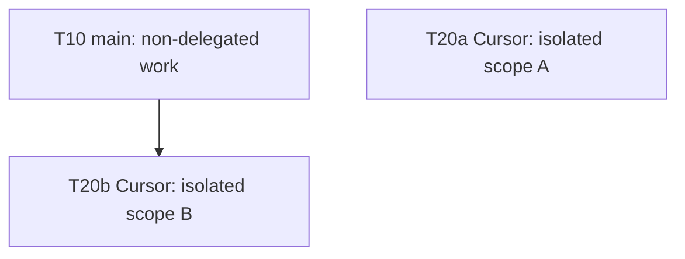
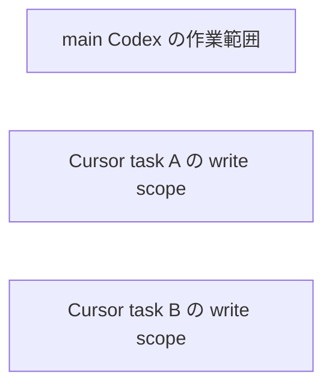

# Task 一覧

## 委任ルール

すべてのtaskは`main-codex`を既定とする。decisionがfixed/bounded、independenceがindependent/staged、write scopeがisolated、oracleがstrong/限定可能なpartial、side effectがlocal/shared reversibleで、参照sourceを持つtaskを`cursor-cli-agent`にする。complexityはprompt量、timeout、検証強度へ反映する。

## 状態一覧

| Task | 状態 | 担当 | Complexity | Decision | Independence | Side effect | Oracle | 依存 | 並列 | Batch | メモ |
| --- | --- | --- | --- | --- | --- | --- | --- | --- | --- | --- | --- |
| T10 | not_started | main-codex | high | unresolved | coupled | local_reversible | partial | [] | main | B1 | 判断・Gate・統合。なければ削除 |
| T20a | not_started | cursor-cli-agent | high | fixed | independent | local_reversible | strong | [] | P1 | B2 | 参照駆動の独立write scope A |
| T20b | not_started | cursor-cli-agent | medium | bounded | staged | local_reversible | strong | [T10] | P1 | B2 | Gate後に独立するwrite scope B |

状態値: `not_started`, `ready`, `running`, `needs_review`, `accepted`, `blocked`, `done`, `failed`, `deferred`

## 作業依存グラフ

`depends_on` が解決済みで、write scope が重ならない同一 `parallel_group` は、1 件ずつ完了待ちせず連続 submit してからまとめて monitor する。

```mermaid
flowchart TD
  T10["T10 main: non-delegated work"]
  T20a["T20a Cursor: isolated scope A"]
  T20b["T20b Cursor: isolated scope B"]

  T10 --> T20b
```

## ファイル依存グラフ

main Codex と各 worker、または複数 worker の write scope を重ねない。

```mermaid
flowchart LR
  Main["main Codex の作業範囲"]
  FileA["Cursor task A の write scope"]
  FileB["Cursor task B の write scope"]
```

## 投入待ち

- `<task id>`: <今すぐ投入してよい理由>

## 並列投入計画

| 並列グループ | ready task | submit 順 | monitor command | 受け入れ方法 |
| --- | --- | --- | --- | --- |
| P1 | T20a, T20b | T20a -> T20b を連続 submit | `--monitor-all --wait --max-records 2` | main Codex が各 write scope の diff と focused check を確認 |

Cursor CLI 投入ルール:

- 同じ `parallel_group` の ready task は、各 `--submit` の成功だけ確認して次 task を投入する。
- worker の実装完了は個別に待たず、対象 group を全部 submit してから `--monitor-all` で待つ。
- Cursor CLI preflight は task graph や投入前 checklist に入れない。submit / monitor が CLI 疎通問題で失敗した場合だけ実行する。

## 例外処理: Cursor CLI 疎通失敗

`--submit` / `--monitor-registry` / `--monitor-all` が CLI-level error で失敗した場合だけ使う。

- 追加の Cursor CLI worker 投入を止める。
- `run_cursor_cli_delegate.sh --preflight --workspace <workspace>` を実行する。
- smoke task 由来の tracked diff がないことを `git status --short` で確認する。
- preflight 成功後に再投入する。復旧しない場合は委任を中止し、main Codex が引き取る。

## 停止中

| Task | 停止理由 | 解除条件 |
| --- | --- | --- |
| `<task id>` | `<task id or decision>` | <解除条件> |

## 競合表

| Task | 競合先 | 理由 | 解決方法 |
| --- | --- | --- | --- |
| `<task id>` | `<task id>` | `<same write scope>` | Cursor へ委任せず main Codex が扱う |

## 受け入れ単位

| Batch | Tasks | 確認 |
| --- | --- | --- |
| B1 | T10 | main Codex の通常作業として確認 |
| B2 | T20a, T20b | worker diff、write scope、focused check を確認 |

## 作業契約

### T10: <main Codex が実行する作業>

owner: main-codex
status: not_started
depends_on: []
complexity: high
decision_state: unresolved
independence: coupled
side_effect_scope: local_reversible
verification_oracle: partial
parallel_group: main
acceptance_batch: B1

purpose:

- <Cursor 委任条件を満たさない作業。なければこの task を削除する。>

read_scope:

- `<path>`

write_scope:

- `<path>`

acceptance:

- <外から観測できる完了条件>

verification:

- main:
  - `<command>`

### T20a: <Cursor task A>

owner: cursor-cli-agent
status: not_started
depends_on: []
complexity: high
decision_state: fixed
independence: independent
side_effect_scope: local_reversible
verification_oracle: strong
parallel_group: P1
acceptance_batch: B2

purpose:

- <workerが新しい判断を足さず、独立完結できる成果を1つ書く>

read_scope:

- `<absolute path>`

fixed_contract_or_reference:

- `<mainが固定したinvariant / negative case / tie-break rule>`
- `<existing pattern / reference implementation / fixture / test>`

write_scope:

- `<allowed path>`

forbidden_paths:

- `docs/PLAN/**`
- `.codex/skills/**`
- allowed write scope 外のファイル
- version control / remote 操作

constraints:

- 未解決のarchitecture、product、security、data ownership判断が必要になったら停止して報告する。
- production、外部設定、実data、課金、権限などローカルdiffで戻せないstateを変更しない。

acceptance:

- <worker diff が満たすべき観測可能な条件>

verification:

- worker:
  - `<focused command>`
- main:
  - `git diff -- <allowed paths>`
  - `<acceptance command>`

final_report:

- `TASK_ID: T20a`
- 変更したファイル
- 変更内容の要約
- 実行した検証と結果
- main Codex に残した作業

### T20b: <Cursor task B>

owner: cursor-cli-agent
status: not_started
depends_on: [T10]
complexity: medium
decision_state: bounded
independence: staged
side_effect_scope: local_reversible
verification_oracle: strong
parallel_group: P1
acceptance_batch: B2

purpose:

- <workerが新しい判断を足さず、独立完結できる成果を1つ書く>

read_scope:

- `<absolute path>`

fixed_contract_or_reference:

- `<mainが固定したinvariant / negative case / tie-break rule>`
- `<existing pattern / reference implementation / fixture / test>`

write_scope:

- `<T20a と重ならない allowed path>`

forbidden_paths:

- `docs/PLAN/**`
- `.codex/skills/**`
- allowed write scope 外のファイル
- version control / remote 操作

constraints:

- 未解決のarchitecture、product、security、data ownership判断が必要になったら停止して報告する。
- production、外部設定、実data、課金、権限などローカルdiffで戻せないstateを変更しない。

acceptance:

- <worker diff が満たすべき観測可能な条件>

verification:

- worker:
  - `<focused command>`
- main:
  - `git diff -- <allowed paths>`
  - `<acceptance command>`

final_report:

- `TASK_ID: T20b`
- 変更したファイル
- 変更内容の要約
- 実行した検証と結果
- main Codex に残した作業
