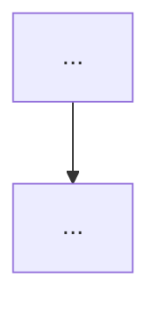

# spec.md Template for spec-codex

`docs/PLAN/{YYMMDD}_{slug}/spec.md` はこの構成で作成する。`tasks.json` が Gate 契約の Single Source of Truth、`spec.md` は背景、決定事項、参照差分、図、generated タスクリストを読むための文書。

`## タスクリスト` の中身は `sync-spec-md.mjs` が `tasks.json` から生成する。手で書くのは markers だけ。

```markdown
# {タイトル}

## Gate 0: 準備 **必須工程(スキップ不可)**

この仕様書の実行には `spec-codex-run` スキルを使用すること。

**Gate 0 通過条件**: `spec-codex-run` の起動フローに従い、対象 PLAN、実行ディレクトリ、Cursor Agent 使用有無、Preflight 状態を確認済みであること。

## Preflight（環境セットアップ）

> 該当がなければこのセクション全体を省略する。
> Preflight には、network 必須、workspace 外書き込み、対話ログイン/OAuth だけを列挙する。
> ローカル生成、test、build、sandbox 内で実行できる通常コマンドは書かない。

- [ ] **P1**: {タイトル}
- [ ] **P2**: **[手動]** {タイトル}

---

## 概要

{何を達成するかを 1-3 文で書く}

## 背景

{なぜ必要か、現状の問題、参照実装や既存実装との差分を書く}

## 設計決定事項

| # | トピック | 決定 | 根拠 | 影響 |
| --- | --- | --- | --- | --- |
| 1 | ... | ... | ... | ... |

## アーキテクチャ詳細

{必要な Mermaid 図だけを書く。選択は references/diagram-selector.md に従う}



## 変更対象ファイルと影響範囲

### 変更するファイル

| ファイル | 変更内容 |
| --- | --- |

### 新規作成ファイル

| ファイル | 内容 |
| --- | --- |

## 参照すべきファイル（外部参照がある場合のみ）

コードベース外の参照資料だけを書く。コードベース内ファイルは Gate の Constraints / affectedFiles で参照する。

| ファイル | 目的 |
| --- | --- |

## タスクリスト

<!-- generated:begin -->
<!-- generated:end -->

## レビューステータス

- [ ] **レビュー完了** — 人間による最終確認

## 残存リスク

計画段階で解消できる不明点は書かない。外部サービス状態、実機環境、ユーザー権限、将来運用など、計画作成時点で解消できないものだけを書く。

| リスク | 解消不能な理由 | 対応 Gate / AC / Preflight |
| --- | --- | --- |
```

## Notes

- `Gate 0` は必須。
- `Preflight` が空ならセクションを省略する。
- `残存リスク` が空なら「なし」と書く。
- authored section に実装手順本文を書かない。実装判断に必要な制約は `tasks.json.gates[].constraints` へ入れる。

## Todo Labels

### `[TDD]`

入出力が明確で、アサーション検証可能な Todo にだけ付ける。`tasks.json.todos[].tdd: true` と対応させる。

対象例:

- validator
- formatter
- parser
- pure function
- permission / rule 判定
- schema 変換

### `[SIMPLE]`

数行追加、import 追加、定数追加、既知パターンの 1 箇所適用など、局所変更で完結する Todo に付ける。

- Codex review を `SKIPPED` にできる候補になる。
- 複数ファイルにまたがる設計判断、routing、共通 state、export pipeline、実ブラウザ最終確認は `[SIMPLE]` にしない。
- `[SIMPLE]` と `[TDD]` は通常排他的。必要な場合だけ併用する。
