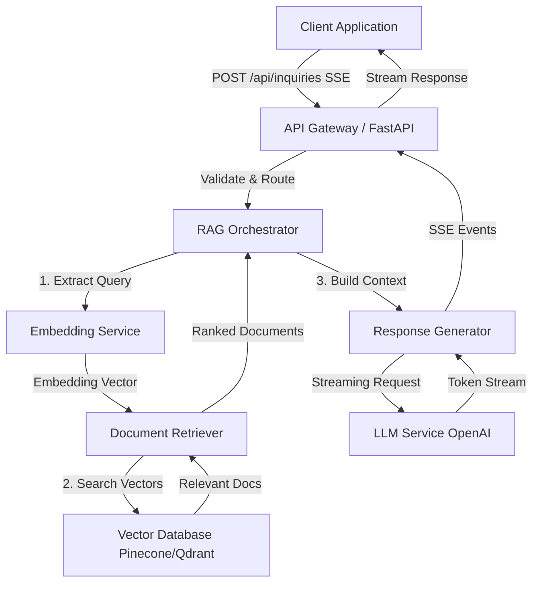
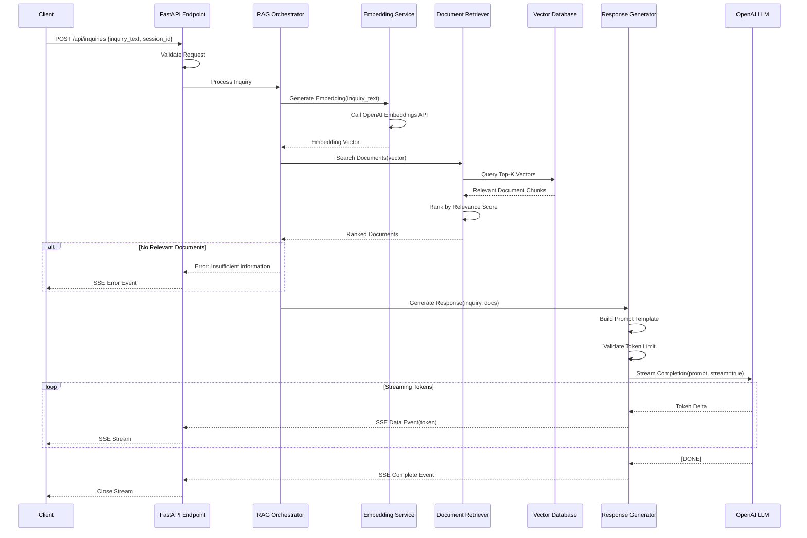
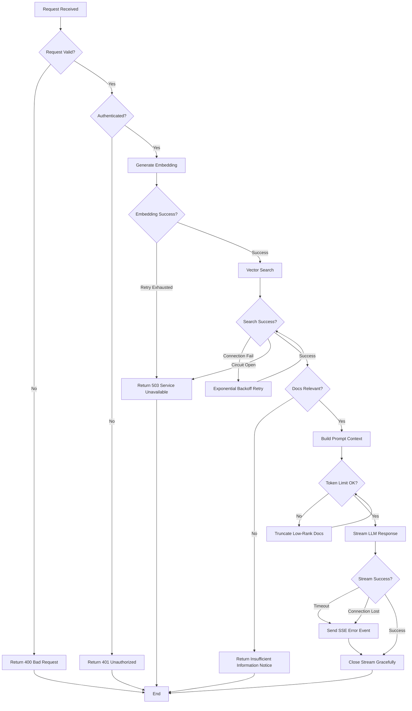
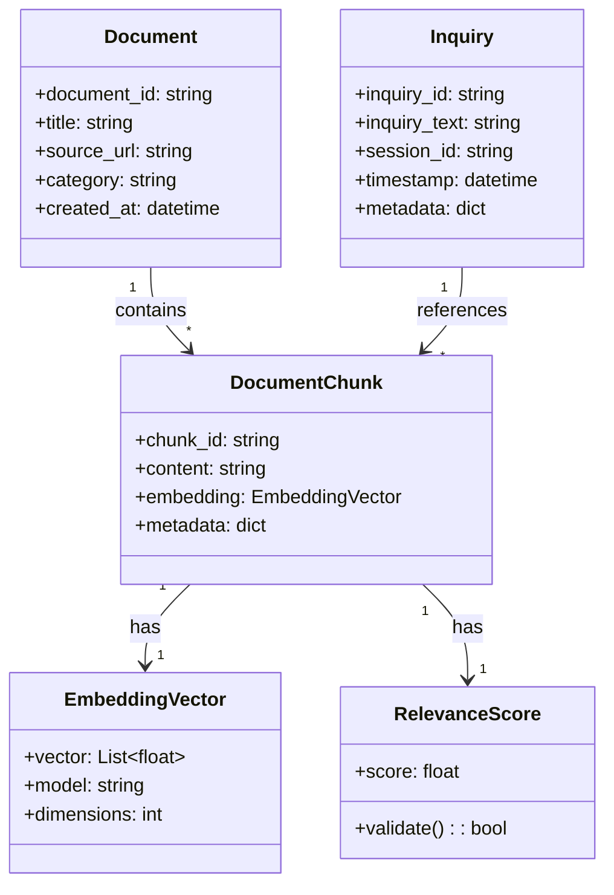

# Technical Design Document

## Overview

This feature provides a RAG (Retrieval-Augmented Generation) based backend API service that automates inquiry response in customer support. It receives inquiries from users, performs semantic search of related documents from a vector database, generates responses using LLM, and delivers them via streaming with Server-Sent Events (SSE).

**Purpose**: Realize improved efficiency for support teams and reduced customer wait times through automation of inquiry response.

**Users**: Frontend systems for customer support, chatbots, and inquiry management tools will use this API to provide AI-generated responses instantly to end users.

**Impact**: Transition from conventional manual response or template responses to dynamic AI response generation based on context, significantly improving response accuracy and speed.

### Goals

- Search related documents with high accuracy based on inquiry content
- Generate natural and accurate responses by LLM in real-time streaming
- Maintain stable performance and scalability even under high load
- Protect the system with secure authentication and input validation
- Ensure operational quality through comprehensive monitoring and observability

### Non-Goals

- Conversation history persistence (Session management is handled by external systems)
- Context management for multi-turn dialogue (Initial implementation is single-turn only)
- Document management features (Upload, update, delete are separate services)
- Frontend UI provision (API only)
- Real-time learning and fine-tuning (Future expansion)

## Architecture

### Architecture Pattern & Boundary Map

**Selected Pattern**: Modular RAG Architecture

This design adopts the Modular RAG pattern that separates Retriever (search), Generator (generation), and Orchestrator (control) as independent components. This pattern clarifies the responsibilities of each component and enables independent testing, deployment, and extension.



**Domain Boundaries**:

- **API Layer**: Request reception, authentication, validation, SSE streaming control
- **Orchestrator**: RAG flow control, error handling, context management
- **Retriever**: Vector search, ranking, document filtering
- **Generator**: LLM invocation, prompt construction, streaming control
- **External Services**: Embedding API, Vector Database, LLM API

**Existing Patterns Preserved**: Not applicable as this is a new implementation

**New Components Rationale**:

- **RAG Orchestrator**: Coordinates search and generation flow, consolidates error handling and retry logic
- **Document Retriever**: Abstracts vector search logic, supports future hybrid search and reranking extensions
- **Response Generator**: Isolates LLM streaming processing, responsible for prompt template management and token control

**Steering Compliance**: No existing steering rules as this is a new project, but adheres to principles of modular design, type safety, and observability.

### Technology Stack

| Layer | Choice / Version | Role in Feature | Notes |
|-------|------------------|-----------------|-------|
| Backend / Services | FastAPI 0.115+ | API endpoints, request processing, SSE streaming | Async/await support, Pydantic type safety, automatic OpenAPI documentation |
| Backend / Services | Uvicorn 0.32+ | ASGI server | FastAPI runtime environment, high-speed asynchronous processing |
| Backend / Services | sse-starlette 2.2+ | SSE implementation | W3C compliant, provides EventSourceResponse |
| Data / Storage | Pinecone(initial) / Qdrant(alternative) | Vector database | Semantic search, scalability |
| External API | OpenAI text-embedding-3-small | Embedding generation | Cost efficiency priority, $0.02/million tokens |
| External API | OpenAI GPT-4o / GPT-4o-mini | LLM response generation | Streaming support, high accuracy response generation |
| Infrastructure / Runtime | Python 3.11+ | Runtime environment | Async/await optimization, enhanced type hints |
| Infrastructure / Runtime | Docker | Containerization | Environment consistency, deployment simplification |

**Technology Selection Rationale**:

- **FastAPI**: Standard choice for Python API backend as of 2025. Async support enables efficient parallel processing of SSE and LLM API calls. See `research.md` for details.
- **Pinecone vs Qdrant**: Pinecone is fully managed with minimal operational overhead, Qdrant is self-hostable with easier cost control. Initial implementation uses Pinecone, with migration path designed for future. See "Vector Database Selection Research" in `research.md` for details.
- **OpenAI Embeddings**: text-embedding-3-small has excellent balance of cost and performance. Alternative is local implementation with Sentence-Transformers. See "Embedding Model Selection Research" in `research.md` for details.
- **SSE Protocol**: Lighter than WebSocket with better HTTP compatibility, optimal for unidirectional streaming. See "Streaming Protocol Selection" in `research.md` for details.

## System Flows

### Primary Flow: Inquiry Processing and Streaming Response Generation



**Flow-Level Decisions**:

- **Retry Logic**: On Embedding/VectorDB/LLM invocation failure, retry with exponential backoff (max 3 times)
- **Timeout**: Set 10 second timeout for each external API call, entire flow times out after 30 seconds
- **Error Gating**: If search results are below threshold (relevance score < 0.7), return "insufficient information" error
- **Token Limit**: If entire prompt exceeds 80% of LLM's context window (e.g., GPT-4o 128k tokens), progressively truncate low-rank documents

### Error Handling Flow



## Requirements Traceability

| Requirement | Summary | Components | Interfaces | Flows |
|-------------|---------|------------|------------|-------|
| 1 | Inquiry Reception API | API Gateway, InquiryEndpoint | POST /api/inquiries | Primary Flow |
| 2 | Document Search Feature | Embedding Service, Document Retriever, Vector Database | EmbeddingService, RetrieverService | Primary Flow |
| 3 | Streaming Response Generation | Response Generator, LLM Service, SSE Handler | GeneratorService, SSE Events | Primary Flow |
| 4 | Context Management | RAG Orchestrator, Prompt Builder | OrchestratorService | Primary Flow |
| 5 | Error Handling and Resilience | Circuit Breaker, Retry Manager, Error Handler | ErrorHandlerService | Error Handling Flow |
| 6 | Performance and Scalability | Connection Pool, Async Handlers | Health Check Endpoint | - |
| 7 | Security and Data Protection | Authentication Middleware, Input Validator | Auth Middleware | - |
| 8 | Monitoring and Observability | Metrics Collector, Structured Logger | Metrics Endpoint | - |

## Components and Interfaces

### Component Summary

| Component | Domain/Layer | Intent | Req Coverage | Key Dependencies (Criticality) | Contracts |
|-----------|--------------|--------|--------------|--------------------------------|-----------|
| InquiryEndpoint | API Layer | Inquiry request reception and SSE streaming | 1, 3, 7 | RAG Orchestrator (P0), Auth Middleware (P0) | API, SSE |
| RAG Orchestrator | Orchestration | RAG flow control and error handling | 4, 5 | Embedding Service (P0), Document Retriever (P0), Response Generator (P0) | Service |
| Embedding Service | Integration | Text vectorization | 2 | OpenAI Embeddings API (P0) | Service |
| Document Retriever | Retrieval | Vector search and ranking | 2 | Vector Database (P0) | Service |
| Response Generator | Generation | LLM response generation and streaming | 3, 4 | OpenAI LLM API (P0) | Service, Event |
| Auth Middleware | Security | Authentication and authorization | 7 | - | API Middleware |
| Metrics Collector | Observability | Metrics collection and publication | 8 | - | API |
| Health Check Service | Observability | Health check | 6, 8 | All External Services (P1) | API |

### API Layer

#### InquiryEndpoint

| Field | Detail |
|-------|--------|
| Intent | Accept inquiry requests and return streaming responses via SSE |
| Requirements | 1, 3, 7 |

**Responsibilities & Constraints**

- Request validation (required field verification, UTF-8 encoding validation)
- Authentication token verification (API Key / JWT)
- Request delegation to RAG Orchestrator
- SSE streaming control and error handling

**Dependencies**

- Inbound: Client Applications — HTTP request transmission (P0)
- Outbound: RAG Orchestrator — RAG processing execution (P0)
- Outbound: Auth Middleware — Authentication verification (P0)

**Contracts**: [x] API [ ] Service [x] Event [ ] Batch [ ] State

##### API Contract

| Method | Endpoint | Request | Response | Errors |
|--------|----------|---------|----------|--------|
| POST | /api/inquiries | InquiryRequest | SSE Stream | 400, 401, 503, 500 |
| GET | /health | - | HealthStatus | 503, 500 |
| GET | /metrics | - | MetricsData | 500 |

**InquiryRequest Schema**:

```typescript
interface InquiryRequest {
  inquiry_text: string;        // Required, max 10000 chars, UTF-8
  session_id: string;           // Required, UUID format
  metadata?: {                  // Optional
    user_id?: string;
    timestamp?: string;         // ISO 8601
  };
}
```

**SSE Event Schema**:

```typescript
// Success Events
interface ResponseTokenEvent {
  event: "token";
  data: {
    content: string;            // Token delta
    sequence: number;           // Token sequence number
  };
}

interface ResponseCompleteEvent {
  event: "complete";
  data: {
    total_tokens: number;
    sources: DocumentSource[];  // Referenced documents
  };
}

// Error Events
interface ErrorEvent {
  event: "error";
  data: {
    error_code: string;         // "INSUFFICIENT_INFO" | "TIMEOUT" | "SERVICE_UNAVAILABLE"
    message: string;
    retry_after?: number;       // Seconds
  };
}
```

**Error Response Codes**:

- **400 Bad Request**: Missing required fields, invalid format
- **401 Unauthorized**: Authentication failure, invalid token
- **503 Service Unavailable**: External service failure (LLM/VectorDB), retry recommended
- **500 Internal Server Error**: Unexpected server error

##### Event Contract

- **Published events**: `token`, `complete`, `error` (SSE)
- **Subscribed events**: None
- **Ordering / delivery guarantees**: Tokens are delivered in generation order, client-side reconnection on connection loss

**Implementation Notes**

- **Integration**: Use `sse-starlette`'s EventSourceResponse, generate token stream with Async generator
- **Validation**: Request validation with Pydantic models, UTF-8 encoding verification, character limit check
- **Risks**: If buffering is enabled in Nginx/load balancer, streaming may be delayed (X-Accel-Buffering: no setting is required)

### Orchestration Layer

#### RAG Orchestrator

| Field | Detail |
|-------|--------|
| Intent | Control the entire flow of Embedding generation, document search, and response generation |
| Requirements | 4, 5 |

**Responsibilities & Constraints**

- Coordination of entire RAG flow (Embedding → Retrieval → Generation)
- Error handling and retry logic (exponential backoff)
- Context construction and token limit management
- Circuit breaker pattern implementation

**Dependencies**

- Inbound: InquiryEndpoint — Inquiry processing request (P0)
- Outbound: Embedding Service — Embedding generation (P0)
- Outbound: Document Retriever — Document search (P0)
- Outbound: Response Generator — Response generation (P0)

**Contracts**: [x] Service [ ] API [ ] Event [ ] Batch [ ] State

##### Service Interface

```typescript
interface RAGOrchestratorService {
  processInquiry(request: InquiryRequest): AsyncGenerator<ResponseEvent, void, void>;
}

interface InquiryRequest {
  inquiry_text: string;
  session_id: string;
  metadata?: Record<string, unknown>;
}

type ResponseEvent =
  | { type: "token"; content: string; sequence: number }
  | { type: "complete"; total_tokens: number; sources: DocumentSource[] }
  | { type: "error"; error_code: string; message: string; retry_after?: number };

interface DocumentSource {
  document_id: string;
  title: string;
  relevance_score: number;
  source_url?: string;
}
```

- **Preconditions**: Request is pre-validated and authenticated
- **Postconditions**: Streaming completion or error event transmission, resource cleanup
- **Invariants**: Always retry or return error on external service failure, context token count is always below LLM limit

**Implementation Notes**

- **Integration**: Asynchronously invoke each service with Async/await pattern, exponential backoff retry on error (initial 1 second, max 8 seconds, max 3 times)
- **Validation**: Search results with relevance_score below threshold (0.7) result in "insufficient information" error, truncate low-rank documents when token count exceeds 80% of LLM limit
- **Risks**: Cascade failure may occur when external services (Embedding/VectorDB/LLM) fail simultaneously (mitigated with circuit breaker)

### Integration Layer

#### Embedding Service

| Field | Detail |
|-------|--------|
| Intent | Vectorize text and generate Embeddings for semantic search |
| Requirements | 2 |

**Responsibilities & Constraints**

- Call OpenAI text-embedding-3-small API to generate Embeddings
- Rate limit mitigation (exponential backoff retry)
- Error handling and fallback

**Dependencies**

- Inbound: RAG Orchestrator — Embedding generation request (P0)
- External: OpenAI Embeddings API — Embedding generation (P0)

For details on OpenAI Embeddings API (rate limits, pricing, dimension specifications), see "Embedding Model Selection Research" in `research.md`.

**Contracts**: [x] Service [ ] API [ ] Event [ ] Batch [ ] State

##### Service Interface

```typescript
interface EmbeddingService {
  generateEmbedding(text: string): Promise<Result<EmbeddingVector, EmbeddingError>>;
  generateEmbeddingBatch(texts: string[]): Promise<Result<EmbeddingVector[], EmbeddingError>>;
}

interface EmbeddingVector {
  vector: number[];             // Length: 1536 for text-embedding-3-small
  model: string;                // "text-embedding-3-small"
  usage: {
    prompt_tokens: number;
    total_tokens: number;
  };
}

type EmbeddingError =
  | { type: "RateLimitError"; retry_after: number }
  | { type: "InvalidInputError"; message: string }
  | { type: "ServiceUnavailableError"; message: string };
```

- **Preconditions**: Text is 8191 tokens or less (text-embedding-3-small limit)
- **Postconditions**: Return EmbeddingVector on success, return error type on failure
- **Invariants**: Always retry on rate limit exceeded, immediately return error on invalid input

**Implementation Notes**

- **Integration**: Use OpenAI Python SDK, set 10 second timeout, enable connection pooling
- **Validation**: Pre-count input text tokens (using tiktoken), return error if limit exceeded
- **Risks**: Entire flow may timeout during retry wait on rate limit exceeded (mitigated with Orchestrator-level timeout monitoring)

#### Document Retriever

| Field | Detail |
|-------|--------|
| Intent | Search related documents from vector database and rank by relevance |
| Requirements | 2 |

**Responsibilities & Constraints**

- Execute queries to vector database (Pinecone/Qdrant)
- Top-K search and score-based ranking
- Connection pooling and retry management

**Dependencies**

- Inbound: RAG Orchestrator — Document search request (P0)
- External: Vector Database (Pinecone/Qdrant) — Vector search (P0)

For Pinecone/Qdrant selection rationale and API specifications, see "Vector Database Selection Research" in `research.md`.

**Contracts**: [x] Service [ ] API [ ] Event [ ] Batch [ ] State

##### Service Interface

```typescript
interface DocumentRetrieverService {
  searchDocuments(query: SearchQuery): Promise<Result<DocumentChunk[], RetrievalError>>;
}

interface SearchQuery {
  embedding: number[];
  top_k: number;                // Default: 5, Range: 1-20
  min_relevance_score: number;  // Default: 0.7, Range: 0.0-1.0
  filters?: MetadataFilter;     // Optional metadata filters
}

interface DocumentChunk {
  chunk_id: string;
  document_id: string;
  content: string;
  metadata: {
    title: string;
    source_url?: string;
    timestamp?: string;
    category?: string;
  };
  relevance_score: number;      // Cosine similarity score
}

type RetrievalError =
  | { type: "ConnectionError"; retry: boolean }
  | { type: "TimeoutError"; message: string }
  | { type: "NoResultsError"; message: string };
```

- **Preconditions**: Query Embedding is valid vector (matching dimensions)
- **Postconditions**: Return document chunks sorted by relevance in descending order, exclude below threshold
- **Invariants**: Retry or return error on search failure, connection pool is always active

**Implementation Notes**

- **Integration**: Use Pinecone Python SDK (initial implementation), connection pool max 10 connections, timeout 5 seconds
- **Validation**: Check top_k range (1-20), apply relevance_score threshold (default 0.7)
- **Risks**: No fallback search on VectorDB connection failure (consider implementing keyword search fallback in future)

#### Response Generator

| Field | Detail |
|-------|--------|
| Intent | Generate responses using LLM and deliver tokens via streaming |
| Requirements | 3, 4 |

**Responsibilities & Constraints**

- Prompt template construction (inquiry + search documents)
- Token limit management and context truncation
- Streaming request to OpenAI LLM API
- SSE event generation and error handling

**Dependencies**

- Inbound: RAG Orchestrator — Response generation request (P0)
- External: OpenAI LLM API (GPT-4o/GPT-4o-mini) — Streaming generation (P0)

For OpenAI LLM API streaming specifications, see "LLM Streaming API Research" in `research.md`.

**Contracts**: [x] Service [ ] API [x] Event [ ] Batch [ ] State

##### Service Interface

```typescript
interface ResponseGeneratorService {
  generateStreamingResponse(request: GenerationRequest): AsyncGenerator<GenerationEvent, void, void>;
}

interface GenerationRequest {
  inquiry_text: string;
  documents: DocumentChunk[];
  session_id: string;
  model?: string;               // Default: "gpt-4o-mini"
  max_tokens?: number;          // Default: 2000
  temperature?: number;         // Default: 0.7
}

type GenerationEvent =
  | { type: "token"; content: string; sequence: number }
  | { type: "complete"; total_tokens: number; finish_reason: string }
  | { type: "error"; error_code: string; message: string };
```

- **Preconditions**: Document list is sorted by relevance, inquiry text is sanitized
- **Postconditions**: Streaming completion or error event transmission, API resource release
- **Invariants**: Entire prompt is below 80% of LLM context window, input sanitization for Prompt Injection mitigation

##### Event Contract

- **Published events**: `token` (token delivery), `complete` (generation complete), `error` (error notification)
- **Subscribed events**: None
- **Ordering / delivery guarantees**: Tokens are delivered in LLM generation order, error event sent then connection closed on network failure

**Implementation Notes**

- **Integration**: Use OpenAI Python SDK, enable streaming with `stream=True`, timeout 30 seconds
- **Validation**: Count tokens after prompt construction (using tiktoken), progressively delete low-rank documents on limit exceeded
- **Risks**: Error notification to client may be delayed on LLM API timeout (mitigated with Orchestrator-level timeout monitoring)

**Prompt Template**:

```
You are an excellent customer support representative. Please refer to the following related documents and provide accurate and courteous responses to user inquiries.

## Inquiry Content
{inquiry_text}

## Reference Documents
{documents}

## Response Generation Rules
- Please respond based on the document content
- If information is not in the documents, do not speculate, and convey "not described in documents"
- Please respond in polite and easy-to-understand Japanese
- Clearly indicate the source of referenced documents

## Response
```

### Security Layer

#### Auth Middleware

| Field | Detail |
|-------|--------|
| Intent | Authenticate and authorize all API requests to prevent unauthorized access |
| Requirements | 7 |

**Responsibilities & Constraints**

- API Key or JWT token verification
- Rate limiting (1000 req/min per API key)
- Return error on authentication failure (without leaking details)

**Dependencies**

- Inbound: All API Endpoints — Authentication verification request (P0)
- External: None (local verification)

**Contracts**: [x] Service [x] API [ ] Event [ ] Batch [ ] State

##### Service Interface

```typescript
interface AuthMiddleware {
  authenticate(request: Request): Result<AuthContext, AuthError>;
}

interface AuthContext {
  api_key_id: string;
  permissions: string[];
  rate_limit: {
    requests_per_minute: number;
    current_usage: number;
  };
}

type AuthError =
  | { type: "InvalidTokenError"; message: string }
  | { type: "ExpiredTokenError"; message: string }
  | { type: "RateLimitExceededError"; retry_after: number };
```

- **Preconditions**: Request header contains `Authorization: Bearer <token>` or `X-API-Key: <key>`
- **Postconditions**: Return AuthContext on success, 401 error on failure
- **Invariants**: Always return 429 error on rate limit exceeded, log authentication error details only (not in response)

**Implementation Notes**

- **Integration**: Implement middleware with FastAPI Dependency Injection, use in-memory cache for API Key verification
- **Validation**: Token signature verification (JWT), expiration check, rate limit counter (using Redis)
- **Risks**: Authentication unavailable on Redis failure for rate limit counter (consider using memory-based counter as fallback)

### Observability Layer

#### Metrics Collector

| Field | Detail |
|-------|--------|
| Intent | Collect performance metrics and publish in Prometheus format |
| Requirements | 8 |

**Responsibilities & Constraints**

- Measure response time, error rate, throughput
- Record component-specific latency (Retrieval, Generation, Total)
- Publish Prometheus endpoint

**Dependencies**

- Inbound: Monitoring Systems (Prometheus/Grafana) — Metrics collection (P1)
- Outbound: All Services — Metrics collection (P2)

**Contracts**: [ ] Service [x] API [ ] Event [ ] Batch [ ] State

##### API Contract

| Method | Endpoint | Request | Response | Errors |
|--------|----------|---------|----------|--------|
| GET | /metrics | - | Prometheus Text Format | 500 |

**Metrics Definitions**:

```
# Request metrics
http_requests_total{method, endpoint, status} counter
http_request_duration_seconds{method, endpoint} histogram

# Component-specific metrics
rag_retrieval_latency_seconds histogram
rag_generation_latency_seconds histogram
rag_total_latency_seconds histogram

# External service metrics
external_api_calls_total{service, status} counter
external_api_latency_seconds{service} histogram

# Error metrics
errors_total{type, component} counter
```

**Implementation Notes**

- **Integration**: Use `prometheus-client` library, automatic instrumentation with FastAPI middleware
- **Validation**: Metric names comply with Prometheus naming conventions, monitor label cardinality
- **Risks**: Metrics collection overhead under high load (mitigated with sampling rate adjustment)

#### Health Check Service

| Field | Detail |
|-------|--------|
| Intent | Check health status of system and dependent services, provide to monitoring system |
| Requirements | 6, 8 |

**Responsibilities & Constraints**

- Self-diagnosis (memory usage, CPU usage)
- External service connectivity check (VectorDB, OpenAI API)
- Health status determination and response return

**Dependencies**

- Inbound: Load Balancers, Monitoring Systems — Health check request (P0)
- Outbound: Vector Database — Connectivity check (P1)
- External: OpenAI API — Connectivity check (P1)

**Contracts**: [ ] Service [x] API [ ] Event [ ] Batch [ ] State

##### API Contract

| Method | Endpoint | Request | Response | Errors |
|--------|----------|---------|----------|--------|
| GET | /health | - | HealthCheckResponse | 503, 500 |

**HealthCheckResponse Schema**:

```typescript
interface HealthCheckResponse {
  status: "healthy" | "degraded" | "unhealthy";
  timestamp: string;              // ISO 8601
  version: string;                // API version
  checks: {
    self: {
      status: "pass" | "fail";
      memory_usage_percent: number;
      cpu_usage_percent: number;
    };
    vector_database: {
      status: "pass" | "fail";
      latency_ms: number;
    };
    openai_api: {
      status: "pass" | "fail";
      latency_ms: number;
    };
  };
}
```

- **Preconditions**: None (no authentication required)
- **Postconditions**: Return response within 100ms (requirement 6)
- **Invariants**: `degraded` status on partial dependent service failure, `unhealthy` on complete failure

**Implementation Notes**

- **Integration**: Send lightweight ping requests to each external service (timeout 500ms)
- **Validation**: `degraded` determination on memory usage exceeding 80%, CPU usage exceeding 90%
- **Risks**: Overall response delay due to external service health check timeout (mitigated with parallel execution)

## Data Models

### Domain Model

Defines the central domain entities and responsibilities of this system.

**Aggregates**:

- **Inquiry**: Holds inquiry content and session information (root entity)
- **Document**: Document-wide metadata and ownership
- **DocumentChunk**: Searchable fragment of document (child entity of Document)

**Value Objects**:

- **EmbeddingVector**: Vector representation (immutable)
- **RelevanceScore**: Relevance score (0.0-1.0)
- **PromptContext**: Context passed to LLM (immutable)

**Domain Events**:

- **InquiryReceived**: On inquiry reception
- **DocumentsRetrieved**: On related document search completion
- **ResponseGenerated**: On response generation completion
- **ErrorOccurred**: On error occurrence

**Business Rules & Invariants**:

- Inquiry text is 10000 characters or less
- Search result relevance_score must be 0.7 or higher to be usable
- Entire prompt is below 80% of LLM context window
- Token streaming preserves generation order



### Logical Data Model

**Vector Database Schema (Pinecone/Qdrant)**:

- **Index Name**: `customer-support-docs`
- **Dimensions**: 1536 (text-embedding-3-small)
- **Metric**: cosine similarity
- **Namespace**: `production`

**Vector Metadata**:

```typescript
interface VectorMetadata {
  document_id: string;          // UUID
  chunk_id: string;             // UUID
  title: string;                // Document title
  content: string;              // Chunk content (max 2000 chars)
  source_url?: string;          // Optional source URL
  category?: string;            // Optional category tag
  timestamp: string;            // ISO 8601
}
```

**Indexing Strategy**:

- Chunk size: 500 tokens, overlap 50 tokens
- Metadata filtering support (category, timestamp range search)
- Periodic index optimization (weekly)

**No Persistence for Inquiry/Response**: Inquiries and responses are not persisted, session management is handled by external system (Non-Goal)

### Data Contracts & Integration

**API Data Transfer**:

- **Format**: JSON
- **Encoding**: UTF-8
- **Validation**: Pydantic models with strict type checking

**Request Schema**:

```typescript
interface InquiryRequest {
  inquiry_text: string;        // Required, 1-10000 chars
  session_id: string;          // Required, UUID v4
  metadata?: {
    user_id?: string;          // Optional, UUID v4
    timestamp?: string;        // Optional, ISO 8601
  };
}
```

**SSE Event Schemas** (refer to previously mentioned SSE Event Schema)

**Error Response Schema**:

```typescript
interface ErrorResponse {
  error: {
    code: string;              // "INVALID_REQUEST" | "UNAUTHORIZED" | "SERVICE_UNAVAILABLE" | "INTERNAL_ERROR"
    message: string;           // User-friendly message
    details?: string;          // Optional technical details (not exposed in production)
    request_id: string;        // Correlation ID
    timestamp: string;         // ISO 8601
  };
}
```

## Error Handling

### Error Strategy

This system adopts a multi-layer error handling strategy, implementing appropriate error handling and recovery at each layer.

**Error Handling Layers**:

1. **Input Validation Layer**: Request validation, immediately return error (400)
2. **Authentication Layer**: Authentication/authorization error, immediately return error (401)
3. **Integration Layer**: External service failure, retry/fallback/circuit breaker
4. **Business Logic Layer**: Business rule violation, send error event
5. **Infrastructure Layer**: Infrastructure failure, return 503 error

### Error Categories and Responses

**User Errors (4xx)**:

- **Invalid Input (400)**: Field-level validation error message, specify correction procedure
- **Unauthorized (401)**: Authentication failure, recommend token re-acquisition (details not disclosed)
- **Rate Limit Exceeded (429)**: Rate limit exceeded, provide retry_after seconds

**System Errors (5xx)**:

- **Service Unavailable (503)**: External service failure (VectorDB/LLM API), retry recommended, provide retry_after
- **Gateway Timeout (504)**: External API call timeout, retry recommended
- **Internal Server Error (500)**: Unexpected error, troubleshoot with request_id

**Business Logic Errors (422)**:

- **Insufficient Information**: Insufficient related documents, recommend query restructuring
- **Context Overflow**: Token limit exceeded, recommend shortening inquiry text

**Retry & Circuit Breaker**:

- **Exponential Backoff**: Initial 1 second, 2 seconds, 4 seconds, 8 seconds (max 3 retries)
- **Circuit Breaker**: Circuit opens after 5 consecutive failures in 30 seconds (automatically resets after 30 seconds)
- **Timeout Settings**: Embedding API 10 seconds, VectorDB 5 seconds, LLM API 30 seconds, entire flow 60 seconds

### Monitoring

**Error Tracking**:

- Record all errors in structured logs (JSON format)
- Error rate metrics (`errors_total{type, component}`)
- Alert on error occurrence (notification when error rate exceeds 5%)

**Logging Strategy**:

```typescript
interface ErrorLog {
  level: "ERROR" | "WARNING";
  timestamp: string;           // ISO 8601
  request_id: string;          // Correlation ID
  error_type: string;          // Error classification
  error_message: string;       // Error description
  component: string;           // Component where error occurred
  stack_trace?: string;        // Stack trace (development only)
  context: {
    user_id?: string;          // If available
    session_id?: string;
    inquiry_text?: string;     // Sanitized (no PII)
  };
}
```

**Health Monitoring**:

- Monitor dependent service status with health check endpoint (/health)
- Return `degraded` status on external service failure
- Track error rate, latency, throughput with Prometheus metrics

## Testing Strategy

### Unit Tests

- **EmbeddingService.generateEmbedding**: Normal case (valid text), abnormal case (token limit exceeded, rate limit error)
- **DocumentRetriever.searchDocuments**: Top-K search accuracy, relevance_score threshold filtering, connection error retry
- **ResponseGenerator.generateStreamingResponse**: Prompt construction logic, token limit management, streaming event generation
- **AuthMiddleware.authenticate**: API Key verification, JWT verification, rate limit check
- **Prompt Template Builder**: Context construction, sanitization, token truncation logic

### Integration Tests

- **RAG Orchestrator End-to-End Flow**: Entire flow of Embedding generation → Document search → Response generation
- **SSE Streaming**: Client connection, token stream reception, error event handling, connection close
- **External Service Integration**: OpenAI API invocation (using mock), VectorDB connection (using test index)
- **Error Recovery**: Retry logic, circuit breaker operation, fallback handling
- **Authentication & Authorization**: API Key verification, rate limiting, error return on authentication failure

### E2E/API Tests

- **Send inquiry → Receive streaming response**: Normal case full flow, SSE event order verification
- **Error scenarios**: Invalid request (400), authentication failure (401), service failure (503), timeout (504)
- **Concurrent request processing**: Measure throughput and response time with 100 concurrent requests
- **Health check**: Verify status in normal case and dependent service failure case

### Performance/Load Tests

- **Load test**: Stability at 1000 req/min, p95 latency within 3 seconds (requirement 6)
- **Streaming latency**: Measure time to first token delivery (TTFB), verify within 3 seconds
- **Vector search performance**: Search latency within 2 seconds with 10000 document index (requirement 6)
- **Scalability**: Verify load distribution and throughput improvement with horizontal scaling (3 instances)

## Security Considerations

### Authentication & Authorization

- **API Key authentication**: Simple authentication with X-API-Key header (initial implementation)
- **JWT authentication**: Stateless authentication with Bearer token (future expansion)
- **Rate Limiting**: 1000 req/min limit per API Key, 429 error on exceeded

### Input Validation & Sanitization

- **Request validation**: Type validation with Pydantic models, required field verification, character limit
- **Prompt Injection mitigation**: Sanitize inquiry text, fix system prompt, clearly separate user input and system instructions
- **SQL injection mitigation**: Use SDK parameterization for VectorDB queries (not applicable: no direct SQL)

### Data Protection

- **TLS 1.3**: Encrypt all API communication with HTTPS
- **PII protection**: Mask personal information in log output, record inquiry text only after sanitization
- **API Key protection**: Manage with environment variables, prohibit hardcoding in source code, recommend periodic rotation

### Threat Mitigation

- **DDoS mitigation**: Rate limiting, connection limit, recommend using Cloudflare/AWS WAF
- **Prompt Injection**: Input sanitization, system prompt fixation, output validation
- **Data leakage**: Do not return detailed information on authentication failure, do not include PII in error logs

## Performance & Scalability

### Target Metrics

- **Health check response**: Within 100ms (requirement 6.1)
- **Document search**: p95 latency within 2 seconds (requirement 6.2)
- **Streaming start**: Within 3 seconds from inquiry reception to first token delivery (requirement 6.3)
- **Throughput**: 1000 req/min (single instance)

### Scaling Approaches

- **Horizontal scaling**: Improve throughput by adding API instances with stateless design
- **Connection pooling**: Reduce connection overhead with connection pool to VectorDB, OpenAI API
- **Async processing**: Concurrent request processing with FastAPI async/await
- **Load balancing**: Distribute traffic between instances with ALB/Nginx

### Caching Strategies

- **Embedding Cache**: Cache Embeddings for identical inquiry text in Redis (TTL: 1 hour)
- **Document Cache**: Memory cache frequently accessed document chunks (LRU, max 1000 items)
- **API Key Cache**: Memory cache authentication results (TTL: 5 minutes)

**Note**: Cache strategies are not implemented in initial implementation, priority will be determined after performance testing

## Supporting References

### Type Definitions

**Full Type Definitions for Key Interfaces**:

Detailed type definitions are consolidated in this section, only concise types are noted in the main text.

```typescript
// Complete Error Type Definitions
type Result<T, E> =
  | { success: true; value: T }
  | { success: false; error: E };

type APIError =
  | { type: "ValidationError"; field: string; message: string }
  | { type: "AuthenticationError"; message: string }
  | { type: "AuthorizationError"; message: string }
  | { type: "RateLimitError"; retry_after: number; message: string }
  | { type: "ResourceNotFoundError"; resource: string; message: string }
  | { type: "ServiceUnavailableError"; service: string; retry_after?: number; message: string }
  | { type: "TimeoutError"; operation: string; timeout_ms: number; message: string }
  | { type: "InternalServerError"; request_id: string; message: string };

// Complete Request/Response Schemas (consolidate previously mentioned schemas)
```

### Configuration Reference

**Environment Variables**:

```bash
# OpenAI API Configuration
OPENAI_API_KEY=sk-...
OPENAI_EMBEDDING_MODEL=text-embedding-3-small
OPENAI_LLM_MODEL=gpt-4o-mini
OPENAI_MAX_TOKENS=2000
OPENAI_TEMPERATURE=0.7
OPENAI_TIMEOUT_SECONDS=30

# Vector Database Configuration (Pinecone)
PINECONE_API_KEY=...
PINECONE_ENVIRONMENT=us-east-1-aws
PINECONE_INDEX_NAME=customer-support-docs
PINECONE_NAMESPACE=production

# Vector Database Configuration (Qdrant, alternative)
QDRANT_URL=http://localhost:6333
QDRANT_API_KEY=...
QDRANT_COLLECTION_NAME=customer_support_docs

# API Configuration
API_HOST=0.0.0.0
API_PORT=8000
API_WORKERS=4
API_TIMEOUT_SECONDS=60
API_MAX_CONNECTIONS=1000

# Security Configuration
API_KEY_HEADER=X-API-Key
JWT_SECRET_KEY=...
JWT_ALGORITHM=HS256
RATE_LIMIT_PER_MINUTE=1000

# Observability Configuration
LOG_LEVEL=INFO
LOG_FORMAT=json
METRICS_ENABLED=true
TRACING_ENABLED=true

# Feature Flags
ENABLE_EMBEDDING_CACHE=false
ENABLE_DOCUMENT_CACHE=false
ENABLE_CIRCUIT_BREAKER=true
```

**Architecture Decision Records (ADRs)**:

For major decisions in this design, see the "Design Decisions" section of `research.md`:

- Streaming protocol selection (SSE vs WebSocket)
- Vector database selection (Pinecone vs Qdrant vs pgvector)
- Embedding model selection (OpenAI vs Sentence-Transformers)
- Backend framework selection (FastAPI)
