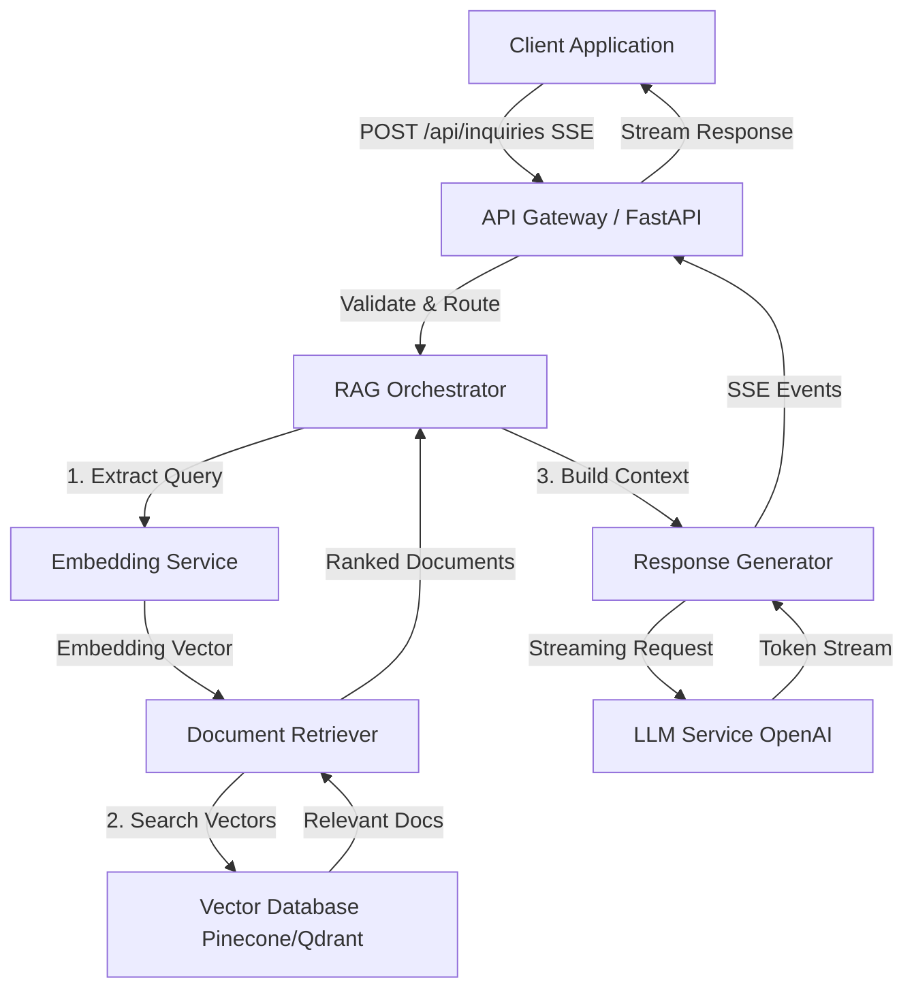
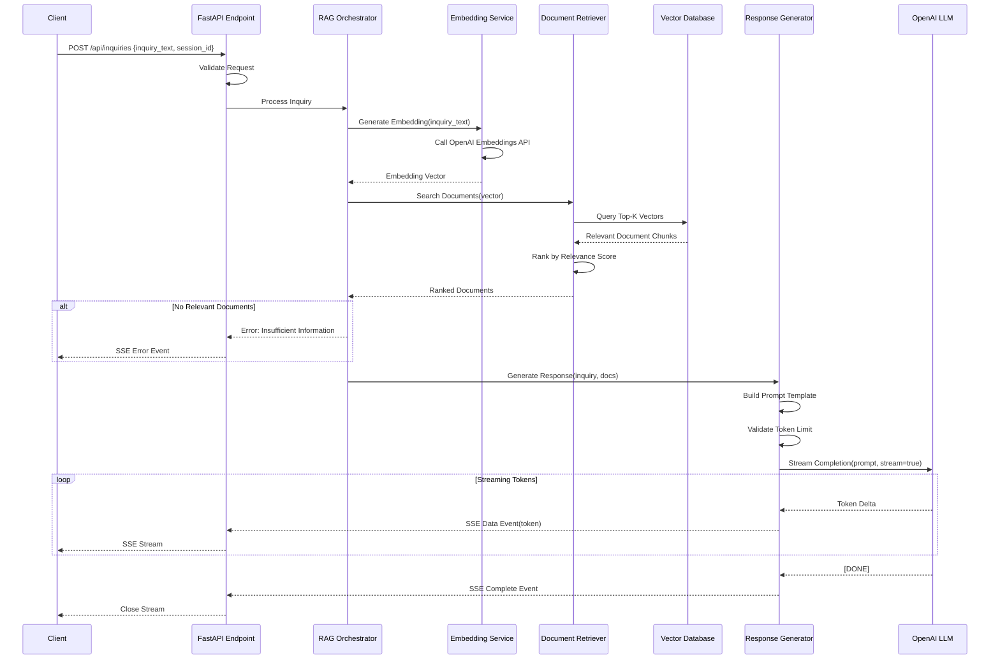
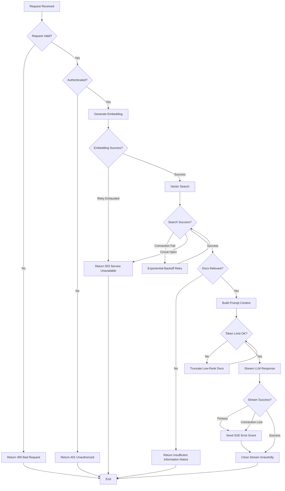
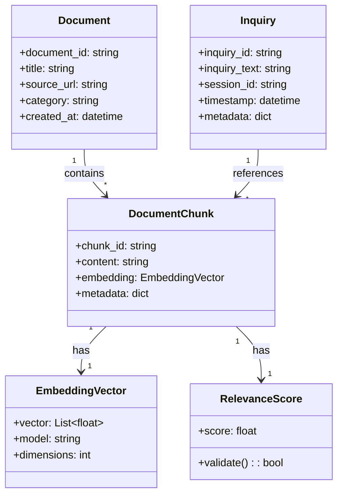

# Technical Design Document

## Overview

本機能は、カスタマーサポートにおける問い合わせ対応を自動化するRAG(Retrieval-Augmented Generation)ベースのバックエンドAPIサービスを提供する。ユーザーからの問い合わせを受け取り、ベクトルデータベースから関連ドキュメントをセマンティック検索し、LLMを用いて回答を生成してServer-Sent Events(SSE)でストリーミング配信する。

**Purpose**: 問い合わせ対応の自動化により、サポートチームの効率向上と顧客の待ち時間短縮を実現する。

**Users**: カスタマーサポートシステムのフロントエンド、チャットボット、問い合わせ管理ツールが本APIを利用し、エンドユーザーに即座にAI生成回答を提供する。

**Impact**: 従来の手動対応またはテンプレート回答から、コンテキストに基づく動的なAI回答生成へと移行し、回答精度と応答速度を大幅に改善する。

### Goals

- 問い合わせ内容に基づいて関連ドキュメントを高精度で検索する
- LLMによる自然で正確な回答をリアルタイムストリーミングで生成する
- 高負荷時でも安定したパフォーマンスとスケーラビリティを維持する
- セキュアな認証と入力検証によりシステムを保護する
- 包括的なモニタリングと可観測性により運用品質を確保する

### Non-Goals

- 会話履歴の永続化(Session管理は外部システムで実施)
- マルチターン対話のコンテキスト管理(初期実装はシングルターンのみ)
- ドキュメント管理機能(アップロード、更新、削除は別サービス)
- フロントエンドUIの提供(APIのみ)
- リアルタイム学習・ファインチューニング(将来的な拡張)

## Architecture

### Architecture Pattern & Boundary Map

**選定パターン**: Modular RAG Architecture

本設計ではRetriever(検索)、Generator(生成)、Orchestrator(制御)を独立コンポーネントとして分離するModular RAGパターンを採用する。このパターンにより、各コンポーネントの責務が明確化され、独立したテスト・デプロイ・拡張が可能になる。



**Domain Boundaries**:

- **API Layer**: リクエスト受付、認証、バリデーション、SSEストリーミング制御
- **Orchestrator**: RAGフローの制御、エラーハンドリング、コンテキスト管理
- **Retriever**: ベクトル検索、ランキング、ドキュメントフィルタリング
- **Generator**: LLM呼び出し、プロンプト構築、ストリーミング制御
- **External Services**: Embedding API、Vector Database、LLM API

**Existing Patterns Preserved**: 新規実装のため該当なし

**New Components Rationale**:

- **RAG Orchestrator**: 検索と生成のフローを調整し、エラーハンドリングとリトライロジックを集約
- **Document Retriever**: ベクトル検索ロジックを抽象化し、将来的なハイブリッド検索やリランキング拡張に対応
- **Response Generator**: LLMストリーミング処理を独立させ、プロンプトテンプレート管理とトークン制御を責務とする

**Steering Compliance**: 新規プロジェクトのため既存steeringルールは存在しないが、モジュラー設計、型安全性、可観測性の原則に準拠する。

### Technology Stack

| Layer | Choice / Version | Role in Feature | Notes |
|-------|------------------|-----------------|-------|
| Backend / Services | FastAPI 0.115+ | APIエンドポイント、リクエスト処理、SSEストリーミング | Async/await対応、Pydantic型安全、自動OpenAPIドキュメント |
| Backend / Services | Uvicorn 0.32+ | ASGIサーバー | FastAPI実行環境、高速非同期処理 |
| Backend / Services | sse-starlette 2.2+ | SSE実装 | W3C準拠、EventSourceResponse提供 |
| Data / Storage | Pinecone(初期) / Qdrant(代替) | ベクトルデータベース | セマンティック検索、スケーラビリティ |
| External API | OpenAI text-embedding-3-small | Embedding生成 | コスト効率重視、$0.02/百万トークン |
| External API | OpenAI GPT-4o / GPT-4o-mini | LLM応答生成 | ストリーミング対応、高精度回答生成 |
| Infrastructure / Runtime | Python 3.11+ | ランタイム環境 | Async/await最適化、型ヒント強化 |
| Infrastructure / Runtime | Docker | コンテナ化 | 環境一貫性、デプロイ簡素化 |

**Technology Selection Rationale**:

- **FastAPI**: 2025年時点でPython APIバックエンドの標準選択肢。Async対応によりSSEとLLM API呼び出しの並行処理が効率的。詳細は`research.md`参照。
- **Pinecone vs Qdrant**: Pineconeはフルマネージドで運用負荷最小、Qdrantはセルフホスト可能でコスト制御が容易。初期実装はPinecone、将来的な移行パスを設計。詳細は`research.md`の"ベクトルデータベース選定調査"参照。
- **OpenAI Embeddings**: text-embedding-3-smallはコストと性能のバランスに優れる。代替案としてSentence-Transformersのローカル実装も可能。詳細は`research.md`の"Embeddingモデル選定調査"参照。
- **SSE Protocol**: WebSocketより軽量でHTTP互換性が高く、一方向ストリーミングに最適。詳細は`research.md`の"ストリーミングプロトコル選定"参照。

## System Flows

### Primary Flow: 問い合わせ処理とストリーミング応答生成



**Flow-Level Decisions**:

- **リトライロジック**: Embedding/VectorDB/LLM呼び出し失敗時は指数バックオフでリトライ(最大3回)
- **タイムアウト**: 各外部API呼び出しに10秒のタイムアウトを設定、全体フローは30秒でタイムアウト
- **エラーゲーティング**: 検索結果が閾値(relevance score < 0.7)未満の場合は"情報不足"エラーを返却
- **トークン制限**: プロンプト全体がLLMのコンテキストウィンドウ(例: GPT-4o 128k tokens)の80%を超える場合、低ランク文書を段階的に切り捨て

### Error Handling Flow



## Requirements Traceability

| Requirement | Summary | Components | Interfaces | Flows |
|-------------|---------|------------|------------|-------|
| 1 | 問い合わせ受付API | API Gateway, InquiryEndpoint | POST /api/inquiries | Primary Flow |
| 2 | ドキュメント検索機能 | Embedding Service, Document Retriever, Vector Database | EmbeddingService, RetrieverService | Primary Flow |
| 3 | ストリーミング回答生成 | Response Generator, LLM Service, SSE Handler | GeneratorService, SSE Events | Primary Flow |
| 4 | コンテキスト管理 | RAG Orchestrator, Prompt Builder | OrchestratorService | Primary Flow |
| 5 | エラーハンドリングとレジリエンス | Circuit Breaker, Retry Manager, Error Handler | ErrorHandlerService | Error Handling Flow |
| 6 | パフォーマンスとスケーラビリティ | Connection Pool, Async Handlers | Health Check Endpoint | - |
| 7 | セキュリティとデータ保護 | Authentication Middleware, Input Validator | Auth Middleware | - |
| 8 | モニタリングと可観測性 | Metrics Collector, Structured Logger | Metrics Endpoint | - |

## Components and Interfaces

### Component Summary

| Component | Domain/Layer | Intent | Req Coverage | Key Dependencies (Criticality) | Contracts |
|-----------|--------------|--------|--------------|--------------------------------|-----------|
| InquiryEndpoint | API Layer | 問い合わせリクエスト受付とSSEストリーミング | 1, 3, 7 | RAG Orchestrator (P0), Auth Middleware (P0) | API, SSE |
| RAG Orchestrator | Orchestration | RAGフロー制御とエラーハンドリング | 4, 5 | Embedding Service (P0), Document Retriever (P0), Response Generator (P0) | Service |
| Embedding Service | Integration | テキストのベクトル化 | 2 | OpenAI Embeddings API (P0) | Service |
| Document Retriever | Retrieval | ベクトル検索とランキング | 2 | Vector Database (P0) | Service |
| Response Generator | Generation | LLM応答生成とストリーミング | 3, 4 | OpenAI LLM API (P0) | Service, Event |
| Auth Middleware | Security | 認証と認可 | 7 | - | API Middleware |
| Metrics Collector | Observability | メトリクス収集と公開 | 8 | - | API |
| Health Check Service | Observability | ヘルスチェック | 6, 8 | All External Services (P1) | API |

### API Layer

#### InquiryEndpoint

| Field | Detail |
|-------|--------|
| Intent | 問い合わせリクエストを受け付け、SSEでストリーミング応答を返却する |
| Requirements | 1, 3, 7 |

**Responsibilities & Constraints**

- リクエストバリデーション(必須フィールド確認、UTF-8エンコーディング検証)
- 認証トークン検証(API Key / JWT)
- RAG Orchestratorへのリクエスト委譲
- SSEストリーミング制御とエラーハンドリング

**Dependencies**

- Inbound: Client Applications — HTTPリクエスト送信 (P0)
- Outbound: RAG Orchestrator — RAG処理実行 (P0)
- Outbound: Auth Middleware — 認証検証 (P0)

**Contracts**: [x] API [ ] Service [x] Event [ ] Batch [ ] State

##### API Contract

| Method | Endpoint | Request | Response | Errors |
|--------|----------|---------|----------|--------|
| POST | /api/inquiries | InquiryRequest | SSE Stream | 400, 401, 503, 500 |
| GET | /health | - | HealthStatus | 503, 500 |
| GET | /metrics | - | MetricsData | 500 |

**InquiryRequest Schema**:

```typescript
interface InquiryRequest {
  inquiry_text: string;        // Required, max 10000 chars, UTF-8
  session_id: string;           // Required, UUID format
  metadata?: {                  // Optional
    user_id?: string;
    timestamp?: string;         // ISO 8601
  };
}
```

**SSE Event Schema**:

```typescript
// Success Events
interface ResponseTokenEvent {
  event: "token";
  data: {
    content: string;            // Token delta
    sequence: number;           // Token sequence number
  };
}

interface ResponseCompleteEvent {
  event: "complete";
  data: {
    total_tokens: number;
    sources: DocumentSource[];  // Referenced documents
  };
}

// Error Events
interface ErrorEvent {
  event: "error";
  data: {
    error_code: string;         // "INSUFFICIENT_INFO" | "TIMEOUT" | "SERVICE_UNAVAILABLE"
    message: string;
    retry_after?: number;       // Seconds
  };
}
```

**Error Response Codes**:

- **400 Bad Request**: 必須フィールド欠落、不正なフォーマット
- **401 Unauthorized**: 認証失敗、無効なトークン
- **503 Service Unavailable**: 外部サービス障害(LLM/VectorDB)、リトライ推奨
- **500 Internal Server Error**: 予期しないサーバーエラー

##### Event Contract

- **Published events**: `token`, `complete`, `error` (SSE)
- **Subscribed events**: なし
- **Ordering / delivery guarantees**: トークンは生成順序で配信、接続断絶時はクライアント側で再接続

**Implementation Notes**

- **Integration**: `sse-starlette`のEventSourceResponseを使用、Async generatorでトークンストリーム生成
- **Validation**: Pydanticモデルでリクエスト検証、UTF-8エンコーディング確認、文字数制限チェック
- **Risks**: Nginx/ロードバランサーでバッファリングが有効な場合、ストリーミングが遅延する可能性(X-Accel-Buffering: no設定が必須)

### Orchestration Layer

#### RAG Orchestrator

| Field | Detail |
|-------|--------|
| Intent | Embedding生成、ドキュメント検索、応答生成の一連のフローを制御する |
| Requirements | 4, 5 |

**Responsibilities & Constraints**

- RAGフロー全体の調整(Embedding → Retrieval → Generation)
- エラーハンドリングとリトライロジック(指数バックオフ)
- コンテキスト構築とトークン制限管理
- サーキットブレーカーパターン実装

**Dependencies**

- Inbound: InquiryEndpoint — 問い合わせ処理リクエスト (P0)
- Outbound: Embedding Service — Embedding生成 (P0)
- Outbound: Document Retriever — ドキュメント検索 (P0)
- Outbound: Response Generator — 応答生成 (P0)

**Contracts**: [x] Service [ ] API [ ] Event [ ] Batch [ ] State

##### Service Interface

```typescript
interface RAGOrchestratorService {
  processInquiry(request: InquiryRequest): AsyncGenerator<ResponseEvent, void, void>;
}

interface InquiryRequest {
  inquiry_text: string;
  session_id: string;
  metadata?: Record<string, unknown>;
}

type ResponseEvent =
  | { type: "token"; content: string; sequence: number }
  | { type: "complete"; total_tokens: number; sources: DocumentSource[] }
  | { type: "error"; error_code: string; message: string; retry_after?: number };

interface DocumentSource {
  document_id: string;
  title: string;
  relevance_score: number;
  source_url?: string;
}
```

- **Preconditions**: リクエストは事前にバリデーション済み、認証済み
- **Postconditions**: ストリーミング完了またはエラーイベント送信、リソースクリーンアップ
- **Invariants**: 外部サービス障害時は必ずリトライまたはエラー返却、コンテキストトークン数は常にLLM制限未満

**Implementation Notes**

- **Integration**: Async/awaitパターンで各サービスを非同期呼び出し、エラー発生時は指数バックオフリトライ(初回1秒、最大8秒、最大3回)
- **Validation**: relevance_score閾値(0.7)未満の検索結果は"情報不足"エラー、トークン数がLLM制限の80%超過時は低ランク文書を切り捨て
- **Risks**: 外部サービス(Embedding/VectorDB/LLM)の同時障害時にカスケード障害が発生する可能性(サーキットブレーカーで緩和)

### Integration Layer

#### Embedding Service

| Field | Detail |
|-------|--------|
| Intent | テキストをベクトル化し、セマンティック検索用のEmbeddingを生成する |
| Requirements | 2 |

**Responsibilities & Constraints**

- OpenAI text-embedding-3-small APIを呼び出してEmbedding生成
- レート制限対策(指数バックオフリトライ)
- エラーハンドリングとフォールバック

**Dependencies**

- Inbound: RAG Orchestrator — Embedding生成リクエスト (P0)
- External: OpenAI Embeddings API — Embedding生成 (P0)

OpenAI Embeddings APIの詳細(レート制限、価格、ディメンション仕様)は`research.md`の"Embeddingモデル選定調査"を参照。

**Contracts**: [x] Service [ ] API [ ] Event [ ] Batch [ ] State

##### Service Interface

```typescript
interface EmbeddingService {
  generateEmbedding(text: string): Promise<Result<EmbeddingVector, EmbeddingError>>;
  generateEmbeddingBatch(texts: string[]): Promise<Result<EmbeddingVector[], EmbeddingError>>;
}

interface EmbeddingVector {
  vector: number[];             // Length: 1536 for text-embedding-3-small
  model: string;                // "text-embedding-3-small"
  usage: {
    prompt_tokens: number;
    total_tokens: number;
  };
}

type EmbeddingError =
  | { type: "RateLimitError"; retry_after: number }
  | { type: "InvalidInputError"; message: string }
  | { type: "ServiceUnavailableError"; message: string };
```

- **Preconditions**: テキストは8191トークン以下(text-embedding-3-small制限)
- **Postconditions**: 成功時はEmbeddingVector返却、失敗時はエラー型返却
- **Invariants**: レート制限超過時は必ずリトライ、無効入力時は即座にエラー返却

**Implementation Notes**

- **Integration**: OpenAI Python SDKを使用、タイムアウト10秒設定、接続プーリング有効化
- **Validation**: 入力テキストのトークン数を事前カウント(tiktoken使用)、制限超過時はエラー返却
- **Risks**: レート制限超過時のリトライ待機中に全体フロータイムアウトする可能性(Orchestratorレベルのタイムアウト監視で緩和)

#### Document Retriever

| Field | Detail |
|-------|--------|
| Intent | ベクトルデータベースから関連ドキュメントを検索し、関連度でランキングする |
| Requirements | 2 |

**Responsibilities & Constraints**

- ベクトルデータベース(Pinecone/Qdrant)へのクエリ実行
- Top-K検索とスコアベースランキング
- 接続プーリングとリトライ管理

**Dependencies**

- Inbound: RAG Orchestrator — ドキュメント検索リクエスト (P0)
- External: Vector Database (Pinecone/Qdrant) — ベクトル検索 (P0)

Pinecone/Qdrantの選定根拠とAPI仕様は`research.md`の"ベクトルデータベース選定調査"を参照。

**Contracts**: [x] Service [ ] API [ ] Event [ ] Batch [ ] State

##### Service Interface

```typescript
interface DocumentRetrieverService {
  searchDocuments(query: SearchQuery): Promise<Result<DocumentChunk[], RetrievalError>>;
}

interface SearchQuery {
  embedding: number[];
  top_k: number;                // Default: 5, Range: 1-20
  min_relevance_score: number;  // Default: 0.7, Range: 0.0-1.0
  filters?: MetadataFilter;     // Optional metadata filters
}

interface DocumentChunk {
  chunk_id: string;
  document_id: string;
  content: string;
  metadata: {
    title: string;
    source_url?: string;
    timestamp?: string;
    category?: string;
  };
  relevance_score: number;      // Cosine similarity score
}

type RetrievalError =
  | { type: "ConnectionError"; retry: boolean }
  | { type: "TimeoutError"; message: string }
  | { type: "NoResultsError"; message: string };
```

- **Preconditions**: クエリEmbeddingは有効なベクトル(次元数一致)
- **Postconditions**: 関連度降順でソート済みドキュメントチャンクを返却、閾値未満は除外
- **Invariants**: 検索失敗時はリトライまたはエラー返却、接続プールは常に有効

**Implementation Notes**

- **Integration**: Pinecone Python SDK使用(初期実装)、接続プール最大10接続、タイムアウト5秒
- **Validation**: top_k範囲チェック(1-20)、relevance_score閾値適用(デフォルト0.7)
- **Risks**: VectorDB接続障害時にフォールバック検索なし(将来的にキーワード検索フォールバック実装を検討)

#### Response Generator

| Field | Detail |
|-------|--------|
| Intent | LLMを用いて回答を生成し、トークンをストリーミング配信する |
| Requirements | 3, 4 |

**Responsibilities & Constraints**

- プロンプトテンプレート構築(問い合わせ + 検索ドキュメント)
- トークン数制限管理とコンテキスト切り捨て
- OpenAI LLM APIへのストリーミングリクエスト
- SSEイベント生成とエラーハンドリング

**Dependencies**

- Inbound: RAG Orchestrator — 応答生成リクエスト (P0)
- External: OpenAI LLM API (GPT-4o/GPT-4o-mini) — ストリーミング生成 (P0)

OpenAI LLM APIのストリーミング仕様は`research.md`の"LLMストリーミングAPI調査"を参照。

**Contracts**: [x] Service [ ] API [x] Event [ ] Batch [ ] State

##### Service Interface

```typescript
interface ResponseGeneratorService {
  generateStreamingResponse(request: GenerationRequest): AsyncGenerator<GenerationEvent, void, void>;
}

interface GenerationRequest {
  inquiry_text: string;
  documents: DocumentChunk[];
  session_id: string;
  model?: string;               // Default: "gpt-4o-mini"
  max_tokens?: number;          // Default: 2000
  temperature?: number;         // Default: 0.7
}

type GenerationEvent =
  | { type: "token"; content: string; sequence: number }
  | { type: "complete"; total_tokens: number; finish_reason: string }
  | { type: "error"; error_code: string; message: string };
```

- **Preconditions**: ドキュメントリストは関連度でソート済み、問い合わせテキストはサニタイズ済み
- **Postconditions**: ストリーミング完了またはエラーイベント送信、APIリソース解放
- **Invariants**: プロンプト全体はLLMコンテキストウィンドウの80%未満、Prompt Injection対策として入力サニタイズ実施

##### Event Contract

- **Published events**: `token`(トークン配信)、`complete`(生成完了)、`error`(エラー通知)
- **Subscribed events**: なし
- **Ordering / delivery guarantees**: トークンはLLM生成順序で配信、ネットワーク障害時はエラーイベント送信後に接続クローズ

**Implementation Notes**

- **Integration**: OpenAI Python SDK使用、`stream=True`でストリーミング有効化、タイムアウト30秒
- **Validation**: プロンプト構築後にトークン数カウント(tiktoken使用)、制限超過時は低ランク文書を段階的削除
- **Risks**: LLM APIタイムアウト時にクライアントへのエラー通知が遅延する可能性(Orchestratorレベルのタイムアウト監視で緩和)

**Prompt Template**:

```
あなたは優秀なカスタマーサポート担当者です。以下の関連ドキュメントを参照して、ユーザーの問い合わせに正確かつ丁寧に回答してください。

## 問い合わせ内容
{inquiry_text}

## 参照ドキュメント
{documents}

## 回答生成ルール
- ドキュメント内容に基づいて回答してください
- ドキュメントに記載がない情報は推測せず、「ドキュメントに記載がありません」と伝えてください
- 丁寧で分かりやすい日本語で回答してください
- 参照したドキュメントの出典を明示してください

## 回答
```

### Security Layer

#### Auth Middleware

| Field | Detail |
|-------|--------|
| Intent | 全てのAPIリクエストを認証・認可し、不正アクセスを防止する |
| Requirements | 7 |

**Responsibilities & Constraints**

- API KeyまたはJWTトークン検証
- レート制限(1000 req/min per API key)
- 認証失敗時のエラー返却(詳細情報を漏らさない)

**Dependencies**

- Inbound: All API Endpoints — 認証検証リクエスト (P0)
- External: なし(ローカル検証)

**Contracts**: [x] Service [x] API [ ] Event [ ] Batch [ ] State

##### Service Interface

```typescript
interface AuthMiddleware {
  authenticate(request: Request): Result<AuthContext, AuthError>;
}

interface AuthContext {
  api_key_id: string;
  permissions: string[];
  rate_limit: {
    requests_per_minute: number;
    current_usage: number;
  };
}

type AuthError =
  | { type: "InvalidTokenError"; message: string }
  | { type: "ExpiredTokenError"; message: string }
  | { type: "RateLimitExceededError"; retry_after: number };
```

- **Preconditions**: リクエストヘッダーに`Authorization: Bearer <token>`または`X-API-Key: <key>`が存在
- **Postconditions**: 成功時はAuthContext返却、失敗時は401エラー
- **Invariants**: レート制限超過時は必ず429エラー返却、認証エラー詳細はログのみ記録(レスポンスに含めない)

**Implementation Notes**

- **Integration**: FastAPIのDependency Injectionでミドルウェア実装、API Key検証はインメモリキャッシュ使用
- **Validation**: トークン署名検証(JWT)、有効期限チェック、レート制限カウンター(Redis使用)
- **Risks**: レート制限カウンターのRedis障害時に認証不可(フォールバックでメモリベースカウンター使用を検討)

### Observability Layer

#### Metrics Collector

| Field | Detail |
|-------|--------|
| Intent | パフォーマンスメトリクスを収集し、Prometheusフォーマットで公開する |
| Requirements | 8 |

**Responsibilities & Constraints**

- レスポンスタイム、エラー率、スループット測定
- コンポーネント別レイテンシ記録(Retrieval、Generation、Total)
- Prometheusエンドポイント公開

**Dependencies**

- Inbound: Monitoring Systems (Prometheus/Grafana) — メトリクス収集 (P1)
- Outbound: All Services — メトリクス収集 (P2)

**Contracts**: [ ] Service [x] API [ ] Event [ ] Batch [ ] State

##### API Contract

| Method | Endpoint | Request | Response | Errors |
|--------|----------|---------|----------|--------|
| GET | /metrics | - | Prometheus Text Format | 500 |

**Metrics Definitions**:

```
# Request metrics
http_requests_total{method, endpoint, status} counter
http_request_duration_seconds{method, endpoint} histogram

# Component-specific metrics
rag_retrieval_latency_seconds histogram
rag_generation_latency_seconds histogram
rag_total_latency_seconds histogram

# External service metrics
external_api_calls_total{service, status} counter
external_api_latency_seconds{service} histogram

# Error metrics
errors_total{type, component} counter
```

**Implementation Notes**

- **Integration**: `prometheus-client`ライブラリ使用、FastAPIミドルウェアで自動計測
- **Validation**: メトリクス名はPrometheus命名規則準拠、ラベルカーディナリティ監視
- **Risks**: 高負荷時のメトリクス収集オーバーヘッド(サンプリングレート調整で緩和)

#### Health Check Service

| Field | Detail |
|-------|--------|
| Intent | システムと依存サービスのヘルスステータスを確認し、監視システムに提供する |
| Requirements | 6, 8 |

**Responsibilities & Constraints**

- 自己診断(メモリ使用量、CPU使用率)
- 外部サービス疎通確認(VectorDB、OpenAI API)
- ヘルスステータス判定とレスポンス返却

**Dependencies**

- Inbound: Load Balancers, Monitoring Systems — ヘルスチェックリクエスト (P0)
- Outbound: Vector Database — 疎通確認 (P1)
- External: OpenAI API — 疎通確認 (P1)

**Contracts**: [ ] Service [x] API [ ] Event [ ] Batch [ ] State

##### API Contract

| Method | Endpoint | Request | Response | Errors |
|--------|----------|---------|----------|--------|
| GET | /health | - | HealthCheckResponse | 503, 500 |

**HealthCheckResponse Schema**:

```typescript
interface HealthCheckResponse {
  status: "healthy" | "degraded" | "unhealthy";
  timestamp: string;              // ISO 8601
  version: string;                // API version
  checks: {
    self: {
      status: "pass" | "fail";
      memory_usage_percent: number;
      cpu_usage_percent: number;
    };
    vector_database: {
      status: "pass" | "fail";
      latency_ms: number;
    };
    openai_api: {
      status: "pass" | "fail";
      latency_ms: number;
    };
  };
}
```

- **Preconditions**: なし(認証不要)
- **Postconditions**: 100ms以内にレスポンス返却(要件6)
- **Invariants**: 依存サービスの一部障害時は`degraded`ステータス、全障害時は`unhealthy`

**Implementation Notes**

- **Integration**: 各外部サービスに軽量なpingリクエスト送信(タイムアウト500ms)
- **Validation**: メモリ使用率80%超過、CPU使用率90%超過で`degraded`判定
- **Risks**: 外部サービスのヘルスチェックタイムアウトで全体レスポンスが遅延(並行実行で緩和)

## Data Models

### Domain Model

本システムの中心的なドメインエンティティと責務を定義する。

**Aggregates**:

- **Inquiry**: 問い合わせ内容とセッション情報を保持(ルートエンティティ)
- **Document**: ドキュメント全体のメタデータと所有権
- **DocumentChunk**: ドキュメントの検索可能な断片(Documentの子エンティティ)

**Value Objects**:

- **EmbeddingVector**: ベクトル表現(不変)
- **RelevanceScore**: 関連度スコア(0.0-1.0)
- **PromptContext**: LLMへ渡すコンテキスト(不変)

**Domain Events**:

- **InquiryReceived**: 問い合わせ受信時
- **DocumentsRetrieved**: 関連ドキュメント検索完了時
- **ResponseGenerated**: 回答生成完了時
- **ErrorOccurred**: エラー発生時

**Business Rules & Invariants**:

- 問い合わせテキストは10000文字以内
- 検索結果のrelevance_scoreは0.7以上でなければ使用不可
- プロンプト全体はLLMコンテキストウィンドウの80%未満
- トークンストリーミングは生成順序を保持



### Logical Data Model

**Vector Database Schema (Pinecone/Qdrant)**:

- **Index Name**: `customer-support-docs`
- **Dimensions**: 1536 (text-embedding-3-small)
- **Metric**: cosine similarity
- **Namespace**: `production`

**Vector Metadata**:

```typescript
interface VectorMetadata {
  document_id: string;          // UUID
  chunk_id: string;             // UUID
  title: string;                // Document title
  content: string;              // Chunk content (max 2000 chars)
  source_url?: string;          // Optional source URL
  category?: string;            // Optional category tag
  timestamp: string;            // ISO 8601
}
```

**Indexing Strategy**:

- チャンクサイズ: 500トークン、オーバーラップ50トークン
- メタデータフィルタリング対応(category, timestamp範囲検索)
- 定期的なインデックス最適化(週次)

**No Persistence for Inquiry/Response**: 問い合わせと応答は永続化せず、セッション管理は外部システムで実施(Non-Goal)

### Data Contracts & Integration

**API Data Transfer**:

- **Format**: JSON
- **Encoding**: UTF-8
- **Validation**: Pydantic models with strict type checking

**Request Schema**:

```typescript
interface InquiryRequest {
  inquiry_text: string;        // Required, 1-10000 chars
  session_id: string;          // Required, UUID v4
  metadata?: {
    user_id?: string;          // Optional, UUID v4
    timestamp?: string;        // Optional, ISO 8601
  };
}
```

**SSE Event Schemas** (既述のSSE Event Schemaを参照)

**Error Response Schema**:

```typescript
interface ErrorResponse {
  error: {
    code: string;              // "INVALID_REQUEST" | "UNAUTHORIZED" | "SERVICE_UNAVAILABLE" | "INTERNAL_ERROR"
    message: string;           // User-friendly message
    details?: string;          // Optional technical details (not exposed in production)
    request_id: string;        // Correlation ID
    timestamp: string;         // ISO 8601
  };
}
```

## Error Handling

### Error Strategy

本システムは多層エラーハンドリング戦略を採用し、各レイヤーで適切なエラー処理と復旧を実施する。

**Error Handling Layers**:

1. **Input Validation Layer**: リクエスト検証、即座にエラー返却(400)
2. **Authentication Layer**: 認証・認可エラー、即座にエラー返却(401)
3. **Integration Layer**: 外部サービス障害、リトライ・フォールバック・サーキットブレーカー
4. **Business Logic Layer**: ビジネスルール違反、エラーイベント送信
5. **Infrastructure Layer**: インフラ障害、503エラー返却

### Error Categories and Responses

**User Errors (4xx)**:

- **Invalid Input (400)**: フィールドレベルバリデーションエラーメッセージ、修正手順を明示
- **Unauthorized (401)**: 認証失敗、トークン再取得を推奨(詳細情報は非公開)
- **Rate Limit Exceeded (429)**: レート制限超過、retry_after秒数を提供

**System Errors (5xx)**:

- **Service Unavailable (503)**: 外部サービス障害(VectorDB/LLM API)、リトライ推奨、retry_after提供
- **Gateway Timeout (504)**: 外部API呼び出しタイムアウト、リトライ推奨
- **Internal Server Error (500)**: 予期しないエラー、request_idでトラブルシューティング

**Business Logic Errors (422)**:

- **Insufficient Information**: 関連ドキュメント不足、クエリの再構成を推奨
- **Context Overflow**: トークン制限超過、問い合わせテキストの短縮を推奨

**Retry & Circuit Breaker**:

- **Exponential Backoff**: 初回1秒、2秒、4秒、8秒(最大3回リトライ)
- **Circuit Breaker**: 30秒間に5回連続失敗で回路オープン(30秒後に自動リセット)
- **Timeout Settings**: Embedding API 10秒、VectorDB 5秒、LLM API 30秒、全体フロー 60秒

### Monitoring

**Error Tracking**:

- 全エラーを構造化ログに記録(JSON形式)
- エラー率メトリクス(`errors_total{type, component}`)
- エラー発生時のアラート(エラー率5%超過で通知)

**Logging Strategy**:

```typescript
interface ErrorLog {
  level: "ERROR" | "WARNING";
  timestamp: string;           // ISO 8601
  request_id: string;          // Correlation ID
  error_type: string;          // Error classification
  error_message: string;       // Error description
  component: string;           // Component where error occurred
  stack_trace?: string;        // Stack trace (development only)
  context: {
    user_id?: string;          // If available
    session_id?: string;
    inquiry_text?: string;     // Sanitized (no PII)
  };
}
```

**Health Monitoring**:

- ヘルスチェックエンドポイント(/health)で依存サービス状態を監視
- 外部サービス障害時は`degraded`ステータス返却
- Prometheusメトリクスでエラー率、レイテンシ、スループットを追跡

## Testing Strategy

### Unit Tests

- **EmbeddingService.generateEmbedding**: 正常系(有効テキスト)、異常系(トークン制限超過、レート制限エラー)
- **DocumentRetriever.searchDocuments**: Top-K検索精度、relevance_score閾値フィルタリング、接続エラーリトライ
- **ResponseGenerator.generateStreamingResponse**: プロンプト構築ロジック、トークン制限管理、ストリーミングイベント生成
- **AuthMiddleware.authenticate**: API Key検証、JWT検証、レート制限チェック
- **Prompt Template Builder**: コンテキスト構築、サニタイゼーション、トークン切り捨てロジック

### Integration Tests

- **RAG Orchestrator End-to-End Flow**: Embedding生成 → ドキュメント検索 → 応答生成の一連のフロー
- **SSE Streaming**: クライアント接続、トークンストリーム受信、エラーイベント処理、接続クローズ
- **External Service Integration**: OpenAI API呼び出し(モック使用)、VectorDB接続(テストインデックス使用)
- **Error Recovery**: リトライロジック、サーキットブレーカー動作、フォールバック処理
- **Authentication & Authorization**: API Key検証、レート制限、認証失敗時のエラー返却

### E2E/API Tests

- **問い合わせ送信 → ストリーミング応答受信**: 正常系フルフロー、SSEイベント順序検証
- **エラーシナリオ**: 無効リクエスト(400)、認証失敗(401)、サービス障害(503)、タイムアウト(504)
- **並行リクエスト処理**: 100並行リクエストでのスループットとレスポンスタイム測定
- **ヘルスチェック**: 正常時、依存サービス障害時のステータス確認

### Performance/Load Tests

- **負荷テスト**: 1000 req/minでの安定性、p95レイテンシ3秒以内(要件6)
- **ストリーミングレイテンシ**: 最初のトークン配信までの時間(TTFB)を測定、3秒以内を確認
- **ベクトル検索性能**: 10000ドキュメントインデックスでの検索レイテンシ2秒以内(要件6)
- **スケーラビリティ**: 水平スケーリング(3インスタンス)での負荷分散とスループット向上確認

## Security Considerations

### Authentication & Authorization

- **API Key認証**: X-API-Keyヘッダーでのシンプルな認証(初期実装)
- **JWT認証**: Bearer トークンでのステートレス認証(将来的拡張)
- **Rate Limiting**: API Keyごとに1000 req/min制限、超過時は429エラー

### Input Validation & Sanitization

- **リクエストバリデーション**: Pydanticモデルで型検証、必須フィールド確認、文字数制限
- **Prompt Injection対策**: 問い合わせテキストをサニタイズ、システムプロンプト固定化、ユーザー入力とシステム指示を明確に分離
- **SQLインジェクション対策**: ベクトルDBクエリはSDKのパラメータ化機能を使用(該当なし: 直接SQL不使用)

### Data Protection

- **TLS 1.3**: 全API通信をHTTPS暗号化
- **PII保護**: ログ出力時に個人情報をマスキング、問い合わせテキストはサニタイズ後のみ記録
- **API Key保護**: 環境変数で管理、ソースコードにハードコーディング禁止、定期的なローテーション推奨

### Threat Mitigation

- **DDoS対策**: レート制限、接続数制限、Cloudflare/AWS WAF使用推奨
- **Prompt Injection**: 入力サニタイゼーション、システムプロンプト固定化、出力検証
- **データ漏洩**: 認証失敗時に詳細情報を返さない、エラーログにPII含めない

## Performance & Scalability

### Target Metrics

- **ヘルスチェックレスポンス**: 100ms以内(要件6.1)
- **ドキュメント検索**: p95レイテンシ2秒以内(要件6.2)
- **ストリーミング開始**: 問い合わせ受信から最初のトークン配信まで3秒以内(要件6.3)
- **スループット**: 1000 req/min(単一インスタンス)

### Scaling Approaches

- **水平スケーリング**: ステートレス設計によりAPIインスタンスを追加してスループット向上
- **接続プーリング**: VectorDB、OpenAI APIへの接続プールで接続オーバーヘッド削減
- **Async処理**: FastAPIのasync/awaitで並行リクエスト処理
- **負荷分散**: ALB/Nginxでインスタンス間のトラフィック分散

### Caching Strategies

- **Embedding Cache**: 同一問い合わせテキストのEmbeddingをRedisにキャッシュ(TTL: 1時間)
- **Document Cache**: 頻繁にアクセスされるドキュメントチャンクをメモリキャッシュ(LRU、最大1000件)
- **API Key Cache**: 認証結果をメモリキャッシュ(TTL: 5分)

**Note**: キャッシュ戦略は初期実装では未実装、パフォーマンステスト後に優先順位を決定

## Supporting References

### Type Definitions

**Full Type Definitions for Key Interfaces**:

詳細な型定義は本セクションに集約し、本文では簡潔な型のみ記載する。

```typescript
// Complete Error Type Definitions
type Result<T, E> =
  | { success: true; value: T }
  | { success: false; error: E };

type APIError =
  | { type: "ValidationError"; field: string; message: string }
  | { type: "AuthenticationError"; message: string }
  | { type: "AuthorizationError"; message: string }
  | { type: "RateLimitError"; retry_after: number; message: string }
  | { type: "ResourceNotFoundError"; resource: string; message: string }
  | { type: "ServiceUnavailableError"; service: string; retry_after?: number; message: string }
  | { type: "TimeoutError"; operation: string; timeout_ms: number; message: string }
  | { type: "InternalServerError"; request_id: string; message: string };

// Complete Request/Response Schemas (既述のスキーマを統合)
```

### Configuration Reference

**Environment Variables**:

```bash
# OpenAI API Configuration
OPENAI_API_KEY=sk-...
OPENAI_EMBEDDING_MODEL=text-embedding-3-small
OPENAI_LLM_MODEL=gpt-4o-mini
OPENAI_MAX_TOKENS=2000
OPENAI_TEMPERATURE=0.7
OPENAI_TIMEOUT_SECONDS=30

# Vector Database Configuration (Pinecone)
PINECONE_API_KEY=...
PINECONE_ENVIRONMENT=us-east-1-aws
PINECONE_INDEX_NAME=customer-support-docs
PINECONE_NAMESPACE=production

# Vector Database Configuration (Qdrant, alternative)
QDRANT_URL=http://localhost:6333
QDRANT_API_KEY=...
QDRANT_COLLECTION_NAME=customer_support_docs

# API Configuration
API_HOST=0.0.0.0
API_PORT=8000
API_WORKERS=4
API_TIMEOUT_SECONDS=60
API_MAX_CONNECTIONS=1000

# Security Configuration
API_KEY_HEADER=X-API-Key
JWT_SECRET_KEY=...
JWT_ALGORITHM=HS256
RATE_LIMIT_PER_MINUTE=1000

# Observability Configuration
LOG_LEVEL=INFO
LOG_FORMAT=json
METRICS_ENABLED=true
TRACING_ENABLED=true

# Feature Flags
ENABLE_EMBEDDING_CACHE=false
ENABLE_DOCUMENT_CACHE=false
ENABLE_CIRCUIT_BREAKER=true
```

**Architecture Decision Records (ADRs)**:

本設計の主要な判断については`research.md`の"Design Decisions"セクションを参照:

- ストリーミングプロトコル選定(SSE vs WebSocket)
- ベクトルデータベース選定(Pinecone vs Qdrant vs pgvector)
- Embeddingモデル選定(OpenAI vs Sentence-Transformers)
- バックエンドフレームワーク選定(FastAPI)
