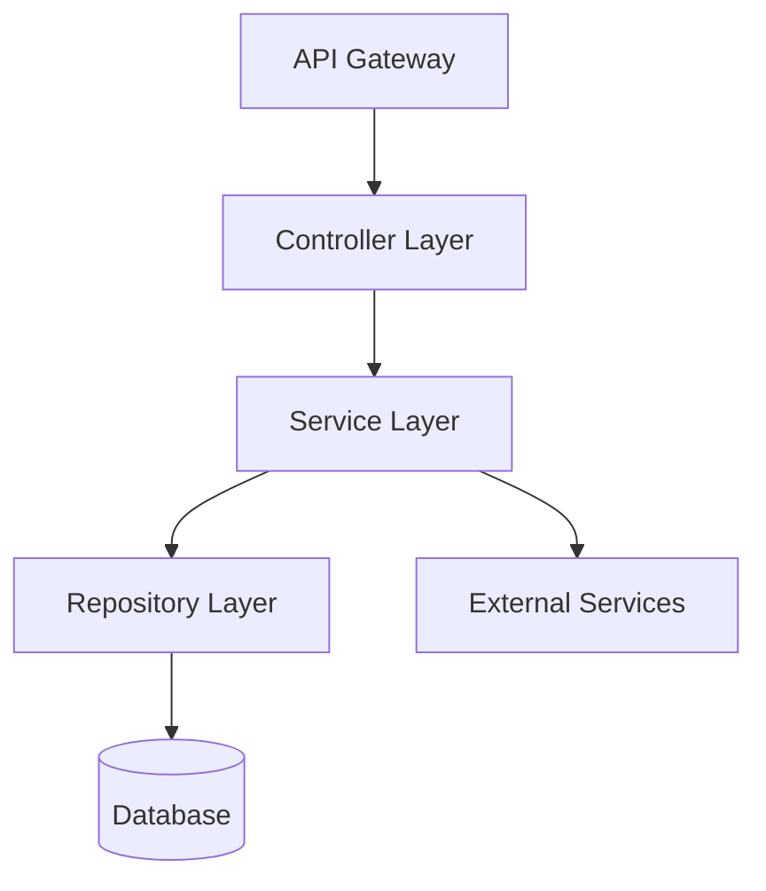

# カスタマイズガイド

> 📖 **English guide:** [Customization Guide](../customization-guide.md)

cc-sdd のテンプレートとルールを編集して、チーム固有のワークフローに適合させる方法を解説します。

## はじめに

cc-sdd は2つのカスタマイズポイントを提供しています：

- **templates/** - AIが生成するドキュメントの**構造・フォーマット**を定義
- **rules/** - AIの**判断基準・生成原則**を定義

どちらも `{{KIRO_DIR}}/settings/` 配下にあり、プロジェクト全体で共有されます。

---

## カスタマイズの2つのアプローチ

### 📄 templates/ - 出力フォーマットをカスタマイズ

**場所**: `{{KIRO_DIR}}/settings/templates/specs/`

**役割**: AIが生成する**ドキュメント構造**を定義します。テンプレートに追加したセクションやフィールドは、AI が自動的に埋めて出力します。

**編集対象ファイル**:
- `requirements.md` - 要件ドキュメントの構造
- `design.md` - 設計ドキュメントの構造
- `tasks.md` - タスク分解の構造

**カスタマイズ例**:
- PRDスタイルのセクション追加（Product Overview、Success Metricsなど）
- 承認チェックリストの追加
- JIRAフィールドの追加

---

### 📋 rules/ - AIの判断基準をカスタマイズ

**場所**: `{{KIRO_DIR}}/settings/rules/`

**役割**: AIの**生成ルール・原則**を定義します。ルールを編集すると、AIの判断基準や生成スタイルが変わります。

**編集対象ファイル**:
- `ears-format.md` - EARS形式の要件記述ルール
- `design-principles.md` - 設計原則とドキュメント標準
- `tasks-generation.md` - タスク分解の粒度と構造ルール
- `tasks-parallel-analysis.md` - 並列実行可能性の判定基準
- その他（`design-discovery-*.md`, `gap-analysis.md`など）

**カスタマイズ例**:
- タスク粒度の調整（1-3時間 → 4-8時間など）
- 設計原則の追加（セキュリティ、パフォーマンス要件など）
- 要件の優先度判定基準

---

## 🚨 絶対に維持すべき構造

cc-sdd のコマンドはAIエージェントを通じてドキュメントを読み取り、理解します。以下の要素は**絶対に維持**してください：

| ファイル | 必須要素 | 理由 |
|---------|---------|------|
| **requirements.md** | 番号付き基準（`1.`, `2.`, `3.`...） | 基準の個数・構造をAIが認識 |
| | テンプレートとの一貫性 | AIがテンプレートから構造を学習 |
| **design.md** | **ファイルの存在** | コマンドが読み込むため |
| **tasks.md** | `- [ ] N.` チェックボックス形式 | タスク実行エンジンが認識 |
| | `_Requirements: X, Y_` 参照 | 要件トレーサビリティ |
| | 階層構造（1, 1.1, 1.2...） | 依存関係の解析 |

**重要**: requirements.md の見出しは自由に変更可能です。AIはテンプレートで定義された構造パターンを学習し、同じパターンで生成します。

### ✅ requirements.md の柔軟性（重要）

requirements.md は非常に柔軟にカスタマイズできます：

#### 1. 見出し名のカスタマイズ

**見出し名は自由に変更可能**です。AIはテンプレートから構造を学習します：

- ✅ **英語**: `### Requirement 1:` / `#### Acceptance Criteria`
- ✅ **日本語**: `### 要件 1:` / `#### 受け入れ基準`
- ✅ **カスタム**: `### REQ-1:` / `#### 検証基準`

**重要な点**:
- 番号付けパターン（`N:` の N）を維持
- 階層構造（`###` と `####`）を維持
- テンプレートと生成済みファイルで一貫性を保つ

#### 2. 受け入れ基準の記述形式

**EARS形式は推奨ですが必須ではありません**：

- ✅ **EARS形式を推奨**: `WHEN [event] THEN [system] SHALL [action]` - AI生成時のデフォルト
- ✅ **他の形式も可能**:
  - シンプル形式: `システムは〇〇に応答する`
  - BDD形式: `GIVEN [context] WHEN [event] THEN [outcome]`
  - カスタム形式: チーム独自のテンプレート
- ✅ **番号付けが重要**: `1.`, `2.`, `3.` の形式を維持すれば内容は自由

**EARS形式の利点**:
- テスト可能性が高い（条件と期待結果が明確）
- AIが理解しやすい（design/tasks生成の精度向上）
- 業界標準（レビュアーが読みやすい）

**必須なのは構造のみ**: AIは構造パターンを学習しますが、具体的な文字列をパースしません。

### 🎯 requirements.md のカスタマイズ例

#### 例1: 日本語見出し + EARS形式（推奨）

```markdown
### 要件 1: ユーザー認証

#### 受け入れ基準
1. WHEN ユーザーがログインボタンをクリック THEN システムは認証画面を表示する
2. IF 無効な認証情報が入力された THEN システムはエラーメッセージを表示する
3. WHILE 認証処理中 THEN システムはローディングインジケーターを表示する
```

**テンプレート設定**:
```markdown
# templates/specs/requirements.md
### 要件 1: {{REQUIREMENT_AREA_1}}
#### 受け入れ基準
```

#### 例2: 英語見出し + BDD形式

```markdown
### Requirement 1: ユーザー認証

#### Acceptance Criteria
1. GIVEN ユーザーがログインページにいる WHEN ログインボタンをクリック THEN 認証画面が表示される
2. GIVEN 無効な認証情報 WHEN ログインを試行 THEN エラーメッセージが表示される
3. GIVEN 認証処理中 WHEN 画面を表示 THEN ローディングインジケーターが表示される
```

#### 例3: カスタムID + シンプル形式

```markdown
### REQ-001: ユーザー認証

#### 検証基準
1. ユーザーがログインボタンをクリックすると、システムは認証画面を表示する
2. 無効な認証情報が入力された場合、システムはエラーメッセージを表示する
3. 認証処理中は、システムはローディングインジケーターを表示する
```

**テンプレート設定**:
```markdown
# templates/specs/requirements.md
### REQ-001: {{REQUIREMENT_AREA_1}}
#### 検証基準
```

#### 例4: デフォルト（英語見出し + EARS形式）

```markdown
### Requirement 1: ユーザー認証

#### Acceptance Criteria
1. WHEN ユーザーがログインボタンをクリック THEN システムは認証画面を表示する
2. IF 無効な認証情報が入力された THEN システムはエラーメッセージを表示する
3. WHILE 認証処理中 THEN システムはローディングインジケーターを表示する
```

**✅ これらの形式は全て有効です。**見出し名とID形式はテンプレートで定義し、記述形式（EARS/BDD/シンプル）はrulesで調整します。

### ✅ design.md の柔軟性（重要）

**design.md は内容的な制約がほぼありません**。チームのレビュープロセスや分析ツールに合わせて自由にカスタマイズできます：

- ✅ **見出し名は自由**: `## Architecture` → `## システム設計`, `## System Design` など変更可能
- ✅ **見出しの順序も自由**: 要件トレーサビリティを先頭に配置、データモデルをアーキテクチャの近くになど
- ✅ **セクションの追加・削除**: チーム固有のレビュー項目を追加、不要なセクションは削除可能
- ✅ **フォーマット変更**: 表形式、箇条書き、図表など自由に選択可能

**Mermaid図について**: 基本構文ルールは `{{KIRO_DIR}}/settings/rules/design-principles.md` で定義されており、templatesの制約ではありません。ルールファイルを編集すれば図の要件も変更できます。

**必須なのはファイルの存在のみ**: コマンドは `design.md` を読み込みますが、特定の見出しやフォーマットをパースしません。

### 🎯 design.md のカスタマイズ例

#### 例1: 社内レビュープロセスに合わせる

```markdown
## 1. 概要（必須）
## 2. ビジネス要件との対応（必須）
## 3. セキュリティレビュー（必須）
## 4. アーキテクチャ設計（必須）
## 5. パフォーマンス検証（P0機能のみ）
## 6. 承認
```

#### 例2: 分析ツール連携

```markdown
## Design-ID: FEAT-2024-001
## Trace-Matrix
| 要件ID | 設計要素 | テストID | 実装ファイル |
|--------|---------|---------|-------------|
| REQ-1 | Component A | TEST-1 | src/a.ts |

## Architecture
...
```

#### 例3: 日本語見出し

```markdown
## 概要
## システム構成
## モジュール設計
## データ構造
## エラー処理
## テスト方針
```

**✅ これらのカスタマイズは全て有効です。**コマンドは影響を受けません。

---

## カスタマイズ手順（3ステップ）

### Step 1: デフォルトテンプレートを確認

```bash
# テンプレートの場所を確認
ls -la {{KIRO_DIR}}/settings/templates/specs/
ls -la {{KIRO_DIR}}/settings/rules/
```

### Step 2: 構造を維持しつつ追加・編集

- **templates/**：セクション・フィールドを追加
- **rules/**：原則・基準を追記

### Step 3: テスト実行で検証

```bash
# 新規specでテスト
/kiro:spec-init Test customization feature
/kiro:spec-requirements test-customization
/kiro:spec-design test-customization
/kiro:spec-tasks test-customization

# 生成されたファイルを確認
cat {{KIRO_DIR}}/specs/test-customization/requirements.md
cat {{KIRO_DIR}}/specs/test-customization/design.md
cat {{KIRO_DIR}}/specs/test-customization/tasks.md
```

---

## 実践シナリオ

チーム固有のニーズに合わせた3つの代表的なカスタマイズシナリオを紹介します。各シナリオは完全なコピペ可能なコードと、テスト方法を含みます。

---

## シナリオ1: PRDスタイルの要件生成

### 📋 カスタマイズ対象

- **templates**: `{{KIRO_DIR}}/settings/templates/specs/requirements.md`
- **rules**: `{{KIRO_DIR}}/settings/rules/ears-format.md` (オプション)

### 🎯 適用ケース

- プロダクト/ビジネスチームがステークホルダーとして参加
- 要件レビューでビジネス文脈・優先度・成功指標が必須
- エンジニア以外のレビュアーが多い

### 🔧 カスタマイズ手順

#### Step 1: テンプレート編集（必須）

**編集ファイル**: `{{KIRO_DIR}}/settings/templates/specs/requirements.md`

**🔒 維持すべき構造**:
- 番号付き見出しパターン（例: `### Requirement N:`, `### 要件 N:`, `### REQ-N:`）
- 基準セクション見出し（例: `#### Acceptance Criteria`, `#### 受け入れ基準`）
- 番号付き基準（`1.`, `2.`, `3.`...）

**💡 見出し名は自由**: テンプレートで定義すれば、AIは同じパターンで生成します。
**💡 推奨**: EARS形式（`WHEN ... THEN ...`）を使用するとAI生成精度が向上しますが、他の形式も使用可能です。

**➕ 追加する完全なテンプレート**:

<details>
<summary><strong>コピペ可能なテンプレート全文</strong></summary>

```markdown
# Requirements Document

## Product Context

**Problem Statement**: {{PROBLEM_DESCRIPTION}}

**Target Users**: {{TARGET_USERS}}

**Success Metrics**: {{SUCCESS_METRICS}}

**Timeline**: {{TIMELINE}}

**Business Impact**: {{BUSINESS_IMPACT}}

---

## Requirements

### Requirement 1: {{REQUIREMENT_AREA_1}}

**Objective**: As a {{ROLE}}, I want {{CAPABILITY}}, so that {{BENEFIT}}

**Business Priority**: P0 (Critical) / P1 (High) / P2 (Medium)

**Dependencies**: {{DEPENDENCIES}}

**Risk Level**: Low / Medium / High

#### Acceptance Criteria

1. WHEN {{EVENT}} THEN the {{SYSTEM}} SHALL {{RESPONSE}}
2. IF {{CONDITION}} THEN the {{SYSTEM}} SHALL {{RESPONSE}}
3. WHERE {{FEATURE_INCLUDED}} THE {{SYSTEM}} SHALL {{RESPONSE}}

**Verification Method**: {{TEST_TYPE}}

**Success Threshold**: {{THRESHOLD}}

---

### Requirement 2: {{REQUIREMENT_AREA_2}}

**Objective**: As a {{ROLE}}, I want {{CAPABILITY}}, so that {{BENEFIT}}

**Business Priority**: P0 / P1 / P2

**Dependencies**: {{DEPENDENCIES}}

**Risk Level**: Low / Medium / High

#### Acceptance Criteria

1. WHEN {{EVENT}} THEN the {{SYSTEM}} SHALL {{RESPONSE}}
2. WHEN {{EVENT}} AND {{CONDITION}} THEN the {{SYSTEM}} SHALL {{RESPONSE}}

**Verification Method**: {{TEST_TYPE}}

**Success Threshold**: {{THRESHOLD}}

<!-- 追加要件は同じパターンで継続 -->

---

## Non-Functional Requirements

### Requirement NFR-1: Performance

**Objective**: System responsiveness and scalability

#### Acceptance Criteria

1. WHEN page loads THEN system SHALL respond within 2 seconds
2. WHEN API called THEN system SHALL respond within 200ms
3. WHEN {{CONCURRENT_USERS}} users access THEN system SHALL maintain response time

**Verification Method**: Load testing

**Success Threshold**: 95th percentile < 200ms

---

### Requirement NFR-2: Security

**Objective**: Data protection and access control

#### Acceptance Criteria

1. WHEN user authenticates THEN system SHALL enforce MFA
2. WHEN data stored THEN system SHALL encrypt at rest
3. WHEN data transmitted THEN system SHALL use TLS 1.3

**Verification Method**: Security audit

**Success Threshold**: Zero critical vulnerabilities

---

## Compliance & Approvals

**Compliance Requirements**: {{COMPLIANCE_LIST}}

**Review Checklist**:
- [ ] Product team reviewed
- [ ] Business stakeholder approved
- [ ] Legal/Compliance reviewed
- [ ] Security team approved

**Approval History**:
- Product Owner: {{APPROVER_NAME}} - {{DATE}}
- Engineering Lead: {{APPROVER_NAME}} - {{DATE}}
```

</details>

#### Step 2: ルール調整（オプション - より厳密な制御が必要な場合）

**編集ファイル**: `{{KIRO_DIR}}/settings/rules/ears-format.md`

**追加内容**:

<details>
<summary><strong>ルールファイルへの追記内容</strong></summary>

```markdown
## PRD-Specific Requirements

### Business Context Requirements

Every requirement MUST include:

- **Priority**: P0 (Critical) / P1 (High) / P2 (Medium)
  - P0: Blocking launch, must have
  - P1: Important for launch, strong preference
  - P2: Nice to have, can defer

- **Timeline**: Target delivery date or sprint number

- **Success Metrics**: Quantifiable measurement
  - User engagement metrics
  - Performance benchmarks
  - Business KPIs

### Verification Standards

Each acceptance criterion MUST specify:

- **Verification Method**:
  - Unit test
  - Integration test
  - Manual QA
  - Acceptance test
  - Performance test
  - Security audit

- **Success Threshold**: Specific measurable value
  - Examples: "< 200ms", "> 95% uptime", "Zero critical bugs"

### Non-Functional Requirements

Always include NFR sections for:
- Performance (response time, throughput)
- Security (authentication, encryption, access control)
- Scalability (concurrent users, data volume)
- Reliability (uptime, error rates)
- Usability (accessibility, UX metrics)
```

</details>

### ✅ 完成後の動作

`/kiro:spec-requirements my-feature` を実行すると:

1. **Product Context** セクションが自動生成される
2. 各要件に **Business Priority**、**Dependencies**、**Risk Level** が含まれる
3. **Verification Method** と **Success Threshold** が各要件に追加される
4. **Non-Functional Requirements** セクションが自動的に生成される
5. **Compliance & Approvals** チェックリストが追加される
6. 要件番号と受け入れ基準の構造は維持される（`/kiro:spec-impl` と互換性あり）

### 🧪 テスト方法

```bash
# 1. テンプレートを編集
vim {{KIRO_DIR}}/settings/templates/specs/requirements.md

# 2. (オプション) ルールを編集
vim {{KIRO_DIR}}/settings/rules/ears-format.md

# 3. 新規specで確認
/kiro:spec-init Test PRD-style requirements with business context
/kiro:spec-requirements test-prd-feature

# 4. 生成されたrequirements.mdを確認
cat {{KIRO_DIR}}/specs/test-prd-feature/requirements.md

# 5. Product Context、Priority、NFRセクションが含まれていることを確認
grep -A 5 "## Product Context" {{KIRO_DIR}}/specs/test-prd-feature/requirements.md
grep "Business Priority" {{KIRO_DIR}}/specs/test-prd-feature/requirements.md
grep -A 3 "## Non-Functional Requirements" {{KIRO_DIR}}/specs/test-prd-feature/requirements.md
```

---

## シナリオ2: バックエンド/API特化の設計ドキュメント

### 📋 カスタマイズ対象

- **templates**: `{{KIRO_DIR}}/settings/templates/specs/design.md`
- **rules**: `{{KIRO_DIR}}/settings/rules/design-principles.md` (オプション)

### 🎯 適用ケース

- REST/GraphQL API開発
- マイクロサービスアーキテクチャ
- データベース設計・スキーマ定義が重要

### 🔧 カスタマイズ手順

#### Step 1: テンプレート編集（必須）

**編集ファイル**: `{{KIRO_DIR}}/settings/templates/specs/design.md`

**🔒 維持すべき構造**:
- **ファイルの存在のみ** - 見出し名・順序・フォーマットは全て自由

**➕ 追加するセクション**:

<details>
<summary><strong>バックエンド特化テンプレート（追加部分）</strong></summary>

既存の `design.md` に以下のセクションを追加：

```markdown
## API Specification

### Base Configuration

**Base URL**: `{{BASE_URL}}`

**API Version**: `v{{VERSION}}`

**Authentication**: Bearer token (JWT) / API Key / OAuth 2.0

**Rate Limiting**: {{RATE_LIMIT}} requests per {{TIME_WINDOW}}

---

### Endpoints

#### POST /api/v1/{{resource}}

**Description**: {{ENDPOINT_DESCRIPTION}}

**Authentication**: Required

**Request Headers**:
```http
Authorization: Bearer {{token}}
Content-Type: application/json
```

**Request Body**:
```json
{
  "field1": "string",
  "field2": 123,
  "field3": {
    "nestedField": "value"
  }
}
```

**Request Validation**:
- `field1`: Required, string, max 255 characters
- `field2`: Required, integer, range 1-1000
- `field3.nestedField`: Optional, string

**Response (200 OK)**:
```json
{
  "data": {
    "id": "uuid",
    "field1": "string",
    "field2": 123,
    "createdAt": "ISO 8601 timestamp"
  },
  "meta": {
    "timestamp": "ISO 8601",
    "requestId": "uuid"
  }
}
```

**Error Responses**:

- **400 Bad Request**:
```json
{
  "error": {
    "code": "INVALID_INPUT",
    "message": "Validation failed",
    "details": {
      "field1": ["Required field missing"]
    }
  }
}
```

- **401 Unauthorized**:
```json
{
  "error": {
    "code": "UNAUTHORIZED",
    "message": "Invalid or expired token"
  }
}
```

- **429 Too Many Requests**:
```json
{
  "error": {
    "code": "RATE_LIMIT_EXCEEDED",
    "message": "Too many requests",
    "retryAfter": 60
  }
}
```

**Rate Limiting Headers**:
```http
X-RateLimit-Limit: 100
X-RateLimit-Remaining: 95
X-RateLimit-Reset: 1640000000
```

---

#### GET /api/v1/{{resource}}/:id

**Description**: {{ENDPOINT_DESCRIPTION}}

**Authentication**: Required

**Path Parameters**:
- `id`: UUID, required

**Query Parameters**:
- `include`: Comma-separated list of related resources
- `fields`: Comma-separated list of fields to return

**Response (200 OK)**:
```json
{
  "data": {
    "id": "uuid",
    "...": "..."
  }
}
```

**Error Responses**:
- **404 Not Found**: Resource does not exist

---

#### PUT /api/v1/{{resource}}/:id

**Description**: {{ENDPOINT_DESCRIPTION}}

**Idempotency**: Yes - multiple identical requests produce same result

---

#### DELETE /api/v1/{{resource}}/:id

**Description**: {{ENDPOINT_DESCRIPTION}}

**Soft Delete**: Yes / No

**Response (204 No Content)**: Empty body

---

### Pagination

**Strategy**: Cursor-based / Offset-based

**Request**:
```http
GET /api/v1/{{resource}}?page=1&limit=20&sort=createdAt:desc
```

**Response**:
```json
{
  "data": [...],
  "meta": {
    "total": 150,
    "page": 1,
    "limit": 20,
    "totalPages": 8
  },
  "links": {
    "first": "{{url}}?page=1",
    "prev": null,
    "next": "{{url}}?page=2",
    "last": "{{url}}?page=8"
  }
}
```

---

### Filtering & Sorting

**Filter Syntax**:
```http
GET /api/v1/{{resource}}?filter[status]=active&filter[createdAt][gte]=2024-01-01
```

**Sort Syntax**:
```http
GET /api/v1/{{resource}}?sort=field1,-field2
```
(Prefix `-` for descending order)

---

### Webhooks (if applicable)

**Webhook Events**:
- `{{resource}}.created`
- `{{resource}}.updated`
- `{{resource}}.deleted`

**Payload**:
```json
{
  "event": "{{resource}}.created",
  "timestamp": "ISO 8601",
  "data": {
    "id": "uuid",
    "...": "..."
  }
}
```

**Webhook Security**: HMAC signature verification

---

## Database Schema

### Tables

#### {{table_name}}

**Schema**:
```sql
CREATE TABLE {{table_name}} (
  id UUID PRIMARY KEY DEFAULT gen_random_uuid(),
  field1 VARCHAR(255) NOT NULL,
  field2 INTEGER NOT NULL CHECK (field2 >= 0),
  field3 JSONB,
  status VARCHAR(50) NOT NULL DEFAULT 'active',
  created_at TIMESTAMP WITH TIME ZONE NOT NULL DEFAULT NOW(),
  updated_at TIMESTAMP WITH TIME ZONE NOT NULL DEFAULT NOW(),
  deleted_at TIMESTAMP WITH TIME ZONE,

  CONSTRAINT {{constraint_name}} UNIQUE (field1)
);
```

**Indexes**:
```sql
CREATE INDEX idx_{{table_name}}_field1 ON {{table_name}} (field1);
CREATE INDEX idx_{{table_name}}_status ON {{table_name}} (status) WHERE deleted_at IS NULL;
CREATE INDEX idx_{{table_name}}_created_at ON {{table_name}} (created_at DESC);
```

**Foreign Keys**:
```sql
ALTER TABLE {{table_name}}
  ADD CONSTRAINT fk_{{relation}}
  FOREIGN KEY ({{foreign_key_column}})
  REFERENCES {{referenced_table}} (id)
  ON DELETE CASCADE;
```

---

### Relationships

```mermaid
erDiagram
    {{TABLE1}} ||--o{ {{TABLE2}} : "has many"
    {{TABLE2}} }o--|| {{TABLE3}} : "belongs to"
```

**Relationship Description**:
- {{TABLE1}} has many {{TABLE2}}: {{DESCRIPTION}}
- {{TABLE2}} belongs to {{TABLE3}}: {{DESCRIPTION}}

---

### Data Migration Strategy

**Migration Order**:
1. {{MIGRATION_1}}: {{DESCRIPTION}}
2. {{MIGRATION_2}}: {{DESCRIPTION}}

**Rollback Plan**: {{ROLLBACK_STRATEGY}}

**Data Seeding**: {{SEED_DATA_DESCRIPTION}}

---

## Service Architecture

### Service Layers



**Layer Responsibilities**:
- **Controller**: Request validation, response formatting
- **Service**: Business logic, transaction management
- **Repository**: Data access, query building
- **External Services**: Third-party API integration

---

### Service Dependencies

```mermaid
graph LR
    A[{{ServiceName}}] --> B[{{DependencyService1}}]
    A --> C[{{DependencyService2}}]
    B --> D[(Database)]
    C --> E[External API]
```

**Dependency Description**:
- {{ServiceName}} depends on {{DependencyService1}} for {{REASON}}
- Circuit breaker pattern for {{ExternalService}}

---

### Background Jobs

**Job Queue**: Redis / RabbitMQ / AWS SQS

**Job Types**:

1. **{{JobName}}**
   - Trigger: {{TRIGGER_CONDITION}}
   - Frequency: {{FREQUENCY}}
   - Timeout: {{TIMEOUT}}
   - Retry Policy: {{RETRY_POLICY}}
   - Failure Handling: {{FAILURE_HANDLING}}

---

## Caching Strategy

### Cache Layers

1. **Application Cache** (Redis)
   - Key pattern: `{{key_pattern}}`
   - TTL: {{TTL}}
   - Invalidation: {{INVALIDATION_STRATEGY}}

2. **Database Query Cache**
   - Cached queries: {{QUERY_LIST}}
   - TTL: {{TTL}}

3. **CDN Cache** (if applicable)
   - Cached assets: {{ASSET_LIST}}
   - TTL: {{TTL}}

### Cache Invalidation

**Strategies**:
- Time-based: {{DESCRIPTION}}
- Event-based: {{DESCRIPTION}}
- Manual: {{DESCRIPTION}}

---

## Security

### Authentication & Authorization

**Authentication Method**: JWT / OAuth 2.0 / API Key

**Token Structure**:
```json
{
  "sub": "user_id",
  "exp": 1640000000,
  "roles": ["admin", "user"],
  "permissions": ["read:resource", "write:resource"]
}
```

**Authorization Model**: RBAC / ABAC

**Protected Resources**:
- {{RESOURCE_1}}: Requires {{PERMISSION}}
- {{RESOURCE_2}}: Requires {{PERMISSION}}

---

### Input Validation

**Validation Rules**:
- Sanitize all user inputs
- Whitelist allowed characters
- Validate data types and ranges
- Prevent SQL injection, XSS, CSRF

**Validation Library**: {{LIBRARY_NAME}}

---

### Data Encryption

**At Rest**:
- Database: AES-256 encryption
- Sensitive fields: {{FIELD_LIST}}

**In Transit**:
- TLS 1.3 for all API communications
- Certificate pinning for mobile clients

---

### Security Headers

```http
Content-Security-Policy: default-src 'self'
X-Content-Type-Options: nosniff
X-Frame-Options: DENY
X-XSS-Protection: 1; mode=block
Strict-Transport-Security: max-age=31536000; includeSubDomains
```

---

## Monitoring & Observability

### Logging

**Log Levels**: DEBUG, INFO, WARN, ERROR

**Structured Logging Format**:
```json
{
  "timestamp": "ISO 8601",
  "level": "INFO",
  "service": "{{service_name}}",
  "traceId": "uuid",
  "message": "...",
  "context": {...}
}
```

**Log Aggregation**: ELK Stack / Datadog / CloudWatch

---

### Metrics

**Application Metrics**:
- Request rate (requests/second)
- Response time (p50, p95, p99)
- Error rate (%)
- Active connections

**Business Metrics**:
- {{METRIC_1}}: {{DESCRIPTION}}
- {{METRIC_2}}: {{DESCRIPTION}}

**Metrics Collection**: Prometheus / Datadog / New Relic

---

### Distributed Tracing

**Tracing System**: Jaeger / Zipkin / AWS X-Ray

**Trace Context Propagation**: W3C Trace Context headers

**Instrumented Operations**:
- Database queries
- External API calls
- Cache operations
- Background jobs

---

### Alerts

**Critical Alerts**:
- Error rate > {{THRESHOLD}}%
- Response time p95 > {{THRESHOLD}}ms
- Database connection pool exhausted
- Disk usage > {{THRESHOLD}}%

**Warning Alerts**:
- Error rate > {{THRESHOLD}}%
- Response time p95 > {{THRESHOLD}}ms

**On-Call Rotation**: {{ROTATION_SCHEDULE}}

---

## Performance & Scalability

### Performance Targets

| Metric | Target | Critical Threshold |
|--------|--------|-------------------|
| API Response Time (p95) | < 200ms | < 500ms |
| Database Query Time (p95) | < 50ms | < 150ms |
| Throughput | {{TARGET}} req/s | {{MIN}} req/s |
| Concurrent Connections | {{TARGET}} | {{MAX}} |

---

### Scalability Strategy

**Horizontal Scaling**:
- Stateless application servers
- Load balancer: {{LB_TYPE}}
- Auto-scaling policy: CPU > {{THRESHOLD}}%

**Database Scaling**:
- Read replicas: {{COUNT}}
- Sharding strategy: {{STRATEGY}}
- Connection pooling: {{POOL_SIZE}}

---

### Load Testing

**Tool**: k6 / JMeter / Gatling

**Test Scenarios**:
1. **Baseline**: {{DESCRIPTION}}
2. **Peak Load**: {{DESCRIPTION}}
3. **Stress Test**: {{DESCRIPTION}}

---

## Error Handling & Resilience

### Retry Logic

**Retry Policy**:
- Max retries: {{MAX_RETRIES}}
- Backoff strategy: Exponential
- Jitter: {{JITTER_ENABLED}}

**Retryable Errors**:
- Network timeouts
- 5xx server errors
- Rate limit errors (429)

---

### Circuit Breaker

**Configuration**:
- Failure threshold: {{THRESHOLD}}%
- Timeout: {{TIMEOUT}}ms
- Reset timeout: {{RESET_TIMEOUT}}s

**Protected Services**:
- {{SERVICE_1}}
- {{SERVICE_2}}

---

### Graceful Degradation

**Fallback Strategies**:
- Cached data: {{DESCRIPTION}}
- Default values: {{DESCRIPTION}}
- Reduced functionality: {{DESCRIPTION}}
```

</details>

#### Step 2: ルール調整（オプション）

**編集ファイル**: `{{KIRO_DIR}}/settings/rules/design-principles.md`

**追加内容**:

<details>
<summary><strong>バックエンド設計原則の追加</strong></summary>

```markdown
## Backend-Specific Design Principles

### API Design Principles

1. **RESTful Resource Modeling**
   - Resources are nouns, not verbs
   - Use HTTP methods correctly (GET, POST, PUT, DELETE)
   - Stateless operations

2. **API Versioning**
   - URL-based versioning: `/api/v1/resource`
   - Maintain backward compatibility within version
   - Deprecation timeline: Minimum 6 months notice

3. **Idempotency**
   - POST: Not idempotent
   - PUT, DELETE, GET: Idempotent
   - Use idempotency keys for critical operations

4. **Error Response Consistency**
   - Structured error format across all endpoints
   - Include error code, message, and optional details
   - Use appropriate HTTP status codes

### Database Design Principles

1. **Normalization**
   - Start with 3NF (Third Normal Form)
   - Denormalize only for proven performance needs
   - Document denormalization decisions

2. **Index Strategy**
   - Index foreign keys
   - Index frequently queried columns
   - Monitor and optimize query performance

3. **Data Integrity**
   - Use database constraints (NOT NULL, UNIQUE, CHECK)
   - Foreign key constraints with appropriate CASCADE rules
   - Validate at both application and database levels

4. **Migration Safety**
   - All schema changes must be reversible
   - Test migrations on production-like data
   - Zero-downtime migration strategy for production

### Service Architecture Principles

1. **Separation of Concerns**
   - Controller: HTTP layer only
   - Service: Business logic
   - Repository: Data access
   - No cross-layer dependencies

2. **Dependency Direction**
   - Always depend on abstractions (interfaces)
   - Outer layers depend on inner layers
   - No circular dependencies

3. **Transaction Management**
   - Keep transactions short
   - Handle transaction boundaries in service layer
   - Use optimistic locking for concurrent updates

### Security Principles

1. **Defense in Depth**
   - Multiple layers of security
   - Validate at every layer (client, API, service, database)
   - Fail securely (deny by default)

2. **Least Privilege**
   - Grant minimum necessary permissions
   - Use role-based access control
   - Regular permission audits

3. **Security by Design**
   - Consider security from design phase
   - Threat modeling for critical features
   - Security review checklist
```

</details>

### ✅ 完成後の動作

`/kiro:spec-design my-backend-feature` を実行すると:

1. **API Specification** で全エンドポイントの詳細仕様が生成される
2. **Database Schema** でテーブル定義、インデックス、制約が明記される
3. **Service Architecture** でレイヤー構造と依存関係が可視化される
4. **Security** セクションで認証・認可・暗号化戦略が定義される
5. **Monitoring & Observability** でログ・メトリクス・トレーシングが計画される
6. バックエンド/API開発に特化した設計ドキュメントが生成される

### 🧪 テスト方法

```bash
# 1. テンプレートを編集
vim {{KIRO_DIR}}/settings/templates/specs/design.md

# 2. 新規specで確認
/kiro:spec-init Build RESTful API for user management
/kiro:spec-requirements user-api
/kiro:spec-design user-api

# 3. 生成されたdesign.mdを確認
cat {{KIRO_DIR}}/specs/user-api/design.md

# 4. バックエンド特化セクションが含まれていることを確認
grep -A 20 "## API Specification" {{KIRO_DIR}}/specs/user-api/design.md
grep -A 15 "## Database Schema" {{KIRO_DIR}}/specs/user-api/design.md
grep -A 10 "## Security" {{KIRO_DIR}}/specs/user-api/design.md
```

---

## シナリオ3: ドメイン固有ルール（Steering Customization）

### 📋 カスタマイズ対象

- **作成**: `/kiro:steering-custom` コマンドで新規作成
- **保存先**: `{{KIRO_DIR}}/steering/{{domain-name}}.md`
- **ルール調整**: `{{KIRO_DIR}}/settings/rules/steering-principles.md` (オプション)

### 🎯 適用ケース

- API標準、認証方式、エラーハンドリングなどのドメイン固有ルールをプロジェクト全体で統一
- 新規メンバーがオンボーディング時に参照できる規約集
- AIに学習させて、全てのspec生成で自動的にルールを反映

### 🔧 カスタマイズ手順

#### Step 1: Steering文書の作成

**コマンド**: `/kiro:steering-custom`

**プロンプト例**:
```
Create domain-specific steering for REST API standards:
- Versioning strategy
- Authentication methods
- Error response format
- Rate limiting
- Pagination
```

**生成されるファイル**: `{{KIRO_DIR}}/steering/api-standards.md`

**完全なテンプレート例**:

<details>
<summary><strong>API Standards Steering 完全例</strong></summary>

```markdown
# API Standards

## Purpose

This steering document defines REST API standards for all backend services in this project. All API designs must follow these conventions to ensure consistency and interoperability.

---

## REST Conventions

### Base URL Structure

**Pattern**: `https://{{domain}}/api/{{version}}/{{resource}}`

**Examples**:
- `https://api.example.com/api/v1/users`
- `https://api.example.com/api/v1/orders/:id`

### Versioning Strategy

**Method**: URL-based versioning

**Version Format**: `/v1`, `/v2`, `/v3`

**Deprecation Policy**:
- New version announcement: Minimum 3 months notice
- Support period: 6 months after new version release
- Sunset timeline: Communicated via API response headers

**Version Headers**:
```http
X-API-Version: v1
X-API-Deprecated: true
X-API-Sunset: 2024-12-31
```

---

### HTTP Methods

**Use Standard Semantics**:

| Method | Usage | Idempotent | Request Body | Response Body |
|--------|-------|-----------|--------------|---------------|
| GET | Retrieve resource(s) | Yes | No | Yes |
| POST | Create new resource | No | Yes | Yes |
| PUT | Update entire resource | Yes | Yes | Yes |
| PATCH | Partial update | No | Yes | Yes |
| DELETE | Remove resource | Yes | No | No (204) |

**Safe Methods** (no side effects): GET, HEAD, OPTIONS

**Idempotent Methods** (same result on multiple calls): GET, PUT, DELETE

---

### Resource Naming

**Rules**:
- Use plural nouns: `/users`, `/orders`, `/products`
- Use kebab-case for multi-word resources: `/user-profiles`
- Avoid verbs in URLs: `/users/123` not `/getUser/123`
- Use sub-resources for relationships: `/users/123/orders`

**Good Examples**:
```
GET /api/v1/users
POST /api/v1/users
GET /api/v1/users/123
PUT /api/v1/users/123
DELETE /api/v1/users/123
GET /api/v1/users/123/orders
```

**Bad Examples**:
```
GET /api/v1/getUsers          # No verbs
POST /api/v1/user             # Use plural
GET /api/v1/user_profiles     # Use kebab-case
```

---

## Authentication

### Methods

**Primary**: Bearer Token (JWT)

**Secondary**: API Key (for server-to-server)

**OAuth 2.0**: For third-party integrations

### JWT Token Structure

**Header**:
```json
{
  "alg": "RS256",
  "typ": "JWT"
}
```

**Payload**:
```json
{
  "sub": "user_id",
  "exp": 1640000000,
  "iat": 1639999000,
  "roles": ["admin", "user"],
  "permissions": ["read:users", "write:users"]
}
```

**Token Expiration**:
- Access Token: 15 minutes
- Refresh Token: 7 days

### Authorization Header

```http
Authorization: Bearer {{jwt_token}}
```

### API Key Authentication

**Header**:
```http
X-API-Key: {{api_key}}
```

**Use Cases**: Server-to-server, webhooks, internal services

---

## Request/Response Format

### Request Format

**Content Type**: `application/json`

**Headers**:
```http
Content-Type: application/json
Accept: application/json
Authorization: Bearer {{token}}
X-Request-ID: {{uuid}}
```

**Body Structure**:
```json
{
  "field1": "value",
  "field2": 123,
  "nested": {
    "field3": "value"
  }
}
```

### Response Format

**Success Response (200, 201)**:
```json
{
  "data": {
    "id": "uuid",
    "field1": "value",
    "createdAt": "2024-01-01T00:00:00Z"
  },
  "meta": {
    "timestamp": "2024-01-01T00:00:00Z",
    "requestId": "uuid"
  }
}
```

**List Response (200)**:
```json
{
  "data": [
    { "id": "1", "...": "..." },
    { "id": "2", "...": "..." }
  ],
  "meta": {
    "total": 150,
    "page": 1,
    "limit": 20,
    "totalPages": 8
  },
  "links": {
    "first": "/api/v1/users?page=1",
    "prev": null,
    "next": "/api/v1/users?page=2",
    "last": "/api/v1/users?page=8"
  }
}
```

**Empty Response (204)**:
- No body
- Used for DELETE success

---

## Error Handling

### Error Response Structure

**Standard Format**:
```json
{
  "error": {
    "code": "ERROR_CODE",
    "message": "Human-readable error message",
    "details": {
      "field": ["Validation error message"]
    },
    "traceId": "uuid"
  },
  "meta": {
    "timestamp": "2024-01-01T00:00:00Z",
    "requestId": "uuid"
  }
}
```

### HTTP Status Codes

**Success (2xx)**:
- `200 OK`: Request succeeded
- `201 Created`: Resource created
- `202 Accepted`: Async operation started
- `204 No Content`: Success with no response body

**Client Errors (4xx)**:
- `400 Bad Request`: Invalid request syntax or validation error
- `401 Unauthorized`: Missing or invalid authentication
- `403 Forbidden`: Authenticated but insufficient permissions
- `404 Not Found`: Resource doesn't exist
- `409 Conflict`: Resource conflict (e.g., duplicate)
- `422 Unprocessable Entity`: Semantic validation error
- `429 Too Many Requests`: Rate limit exceeded

**Server Errors (5xx)**:
- `500 Internal Server Error`: Unexpected server error
- `502 Bad Gateway`: Upstream service error
- `503 Service Unavailable`: Temporary unavailability
- `504 Gateway Timeout`: Upstream timeout

### Error Codes

**Format**: `CATEGORY_SPECIFIC_ERROR`

**Examples**:
- `VALIDATION_REQUIRED_FIELD`: Required field missing
- `VALIDATION_INVALID_FORMAT`: Invalid field format
- `AUTH_INVALID_TOKEN`: JWT token invalid or expired
- `AUTH_INSUFFICIENT_PERMISSIONS`: User lacks permission
- `RESOURCE_NOT_FOUND`: Resource doesn't exist
- `RESOURCE_ALREADY_EXISTS`: Duplicate resource
- `RATE_LIMIT_EXCEEDED`: Too many requests

---

## Rate Limiting

### Rate Limit Policy

**Authenticated Users**:
- 1000 requests per hour
- 100 requests per minute

**Unauthenticated**:
- 100 requests per hour
- 10 requests per minute

**Rate Limit Headers**:
```http
X-RateLimit-Limit: 1000
X-RateLimit-Remaining: 995
X-RateLimit-Reset: 1640000000
Retry-After: 3600
```

### Rate Limit Response

**Status**: `429 Too Many Requests`

**Body**:
```json
{
  "error": {
    "code": "RATE_LIMIT_EXCEEDED",
    "message": "Too many requests. Retry after 3600 seconds.",
    "retryAfter": 3600
  }
}
```

---

## Pagination

### Query Parameters

**Offset-based**:
```
GET /api/v1/users?page=1&limit=20
```

**Cursor-based** (for large datasets):
```
GET /api/v1/users?cursor={{cursor}}&limit=20
```

### Default Values

- `page`: 1
- `limit`: 20 (max: 100)

### Response Structure

See "List Response" in Request/Response Format section above.

---

## Filtering & Sorting

### Filter Syntax

**Simple Filter**:
```
GET /api/v1/users?status=active
```

**Advanced Filter**:
```
GET /api/v1/users?filter[status]=active&filter[createdAt][gte]=2024-01-01
```

**Operators**:
- `eq`: Equals
- `ne`: Not equals
- `gt`: Greater than
- `gte`: Greater than or equal
- `lt`: Less than
- `lte`: Less than or equal
- `in`: In array
- `contains`: String contains

### Sort Syntax

```
GET /api/v1/users?sort=createdAt,-updatedAt
```

**Rules**:
- Prefix `-` for descending order
- Multiple fields comma-separated
- Default: ascending order

---

## Field Selection

**Sparse Fieldsets**:
```
GET /api/v1/users?fields=id,name,email
```

**Include Related Resources**:
```
GET /api/v1/users?include=profile,orders
```

---

## Webhooks

### Event Naming

**Format**: `{{resource}}.{{action}}`

**Examples**:
- `user.created`
- `user.updated`
- `user.deleted`
- `order.created`
- `payment.succeeded`

### Webhook Payload

```json
{
  "event": "user.created",
  "timestamp": "2024-01-01T00:00:00Z",
  "data": {
    "id": "uuid",
    "...": "..."
  },
  "webhookId": "uuid"
}
```

### Security

**HMAC Signature**:
```http
X-Webhook-Signature: sha256={{signature}}
```

**Verification**:
```javascript
const signature = crypto
  .createHmac('sha256', secret)
  .update(JSON.stringify(payload))
  .digest('hex');
```

---

## Idempotency

### Idempotency Keys

**Header**:
```http
Idempotency-Key: {{uuid}}
```

**Usage**: POST, PATCH requests for critical operations

**Behavior**:
- Same key within 24 hours → return cached response
- Different key → process as new request

---

## Deprecation Strategy

### Deprecation Headers

```http
X-API-Deprecated: true
X-API-Sunset: 2024-12-31
X-API-Replacement: /api/v2/users
```

### Timeline

1. **Announcement**: 3 months before deprecation
2. **Warning Period**: Headers added, documentation updated
3. **Deprecation**: Old version marked deprecated
4. **Sunset**: Old version removed (6 months after new version)

---

## Documentation

### OpenAPI/Swagger

**All APIs must**:
- Provide OpenAPI 3.0 spec
- Include examples for all endpoints
- Document all error codes
- Specify authentication requirements

**Documentation URL**: `https://api.example.com/docs`

**Spec URL**: `https://api.example.com/openapi.json`

---

## Testing

### API Testing Requirements

**Every endpoint must have**:
- Unit tests for business logic
- Integration tests for API contracts
- End-to-end tests for critical paths

**Test Coverage**: Minimum 80%

**Contract Testing**: Use Pact or similar for consumer-driven contracts

---

## Monitoring

### Required Metrics

- Request rate (requests/second)
- Response time (p50, p95, p99)
- Error rate (%)
- Rate limit hits

### Logging

**Request Logging**:
```json
{
  "timestamp": "2024-01-01T00:00:00Z",
  "method": "GET",
  "path": "/api/v1/users",
  "statusCode": 200,
  "responseTime": 45,
  "userId": "uuid",
  "requestId": "uuid"
}
```

**Error Logging**:
```json
{
  "timestamp": "2024-01-01T00:00:00Z",
  "level": "ERROR",
  "message": "...",
  "error": {
    "code": "ERROR_CODE",
    "stack": "..."
  },
  "requestId": "uuid",
  "traceId": "uuid"
}
```

---

## Compliance

### GDPR

- Provide data export endpoints
- Implement data deletion endpoints
- Log consent changes
- Include privacy-related headers

### Security

- TLS 1.3 only
- HSTS headers
- CORS configuration
- Input validation
- SQL injection prevention
- XSS prevention

---

## Change Management

### Breaking Changes

**Definition**:
- Removing fields
- Changing field types
- Changing URL structure
- Removing endpoints

**Process**:
1. Announce via changelog
2. Add deprecation headers
3. Provide migration guide
4. Support old version for 6 months

### Non-Breaking Changes

**Examples**:
- Adding optional fields
- Adding new endpoints
- Adding new query parameters

**Process**: Can deploy immediately, document in changelog
```

</details>

#### Step 2: 他のドメインSteering例

<details>
<summary><strong>Authentication Standards</strong></summary>

`{{KIRO_DIR}}/steering/authentication.md`

```markdown
# Authentication Standards

## Password Policy

**Minimum Requirements**:
- Length: 12 characters
- Complexity: Upper, lower, number, special character
- History: Cannot reuse last 5 passwords
- Expiration: 90 days (for privileged accounts)

## Multi-Factor Authentication (MFA)

**Required For**:
- Admin accounts
- Production access
- Financial operations

**Supported Methods**:
- TOTP (Google Authenticator, Authy)
- SMS (fallback only)
- Hardware tokens (YubiKey)

## Session Management

**Session Timeout**:
- Inactive: 30 minutes
- Absolute: 12 hours

**Session Storage**: Redis with encryption

**Session Invalidation**:
- On password change
- On permission change
- On explicit logout

## OAuth 2.0 Flows

**Authorization Code**: Web applications

**Client Credentials**: Server-to-server

**Refresh Token**: Mobile applications

## JWT Best Practices

**Token Expiration**:
- Access: 15 minutes
- Refresh: 7 days

**Claims**:
```json
{
  "sub": "user_id",
  "exp": 1640000000,
  "iat": 1639999000,
  "iss": "api.example.com",
  "aud": "client_id",
  "roles": ["admin"],
  "permissions": ["read:users"]
}
```

**Signing Algorithm**: RS256 (asymmetric)

## API Key Management

**Generation**: Cryptographically secure random

**Storage**: Hashed (bcrypt)

**Rotation**: Every 90 days

**Revocation**: Immediate upon compromise

## Single Sign-On (SSO)

**Protocols**: SAML 2.0, OpenID Connect

**Identity Providers**: Okta, Auth0, Azure AD

**Logout**: Implement SLO (Single Logout)
```

</details>

<details>
<summary><strong>Testing Standards</strong></summary>

`{{KIRO_DIR}}/steering/testing.md`

```markdown
# Testing Standards

## Test Coverage Requirements

**Minimum Coverage**:
- Unit Tests: 80%
- Integration Tests: 60%
- E2E Tests: Critical paths only

## Unit Testing

**Framework**: Jest / Vitest / pytest

**Naming Convention**: `{{function_name}}.test.{{ext}}`

**Structure**:
```javascript
describe('ComponentName', () => {
  describe('methodName', () => {
    it('should return expected value when condition', () => {
      // Arrange
      const input = ...;

      // Act
      const result = method(input);

      // Assert
      expect(result).toBe(expected);
    });
  });
});
```

**Mocking Strategy**:
- Mock external dependencies
- Use test doubles for databases
- Avoid mocking internal code

## Integration Testing

**Scope**: Multiple components together

**Database**: Use test database or containers

**External Services**: Use mocks or test endpoints

## E2E Testing

**Framework**: Playwright / Cypress

**Test Data**: Use factories and fixtures

**Parallel Execution**: Yes

**Critical Paths**:
- User registration and login
- Core business workflows
- Payment flows

## Test Data Management

**Factories**: Use Factory pattern for test data

**Fixtures**: JSON files for complex data

**Database Seeding**: Automated via migration scripts

## Continuous Integration

**CI Pipeline**:
1. Lint
2. Unit tests
3. Integration tests
4. E2E tests (on PR)
5. Build
6. Deploy to staging

**Failure Handling**: Block merge on failure

**Test Reporting**: Publish coverage reports
```

</details>

<details>
<summary><strong>Error Handling Standards</strong></summary>

`{{KIRO_DIR}}/steering/error-handling.md`

```markdown
# Error Handling Standards

## Error Classification

### User Errors (4xx)
- Input validation failures
- Authentication failures
- Permission denials
- Resource not found

**Handling**: Return helpful error message

### System Errors (5xx)
- Database connection failures
- External service timeouts
- Unexpected exceptions

**Handling**: Log detailed error, return generic message to user

## Error Response Format

**Structure**:
```json
{
  "error": {
    "code": "ERROR_CODE",
    "message": "User-friendly message",
    "details": {...},
    "traceId": "uuid"
  }
}
```

## Error Logging

**Log Levels**:
- DEBUG: Diagnostic information
- INFO: Normal operations
- WARN: Recoverable issues
- ERROR: Failures requiring attention
- FATAL: Critical failures

**Structured Logging**:
```json
{
  "timestamp": "ISO 8601",
  "level": "ERROR",
  "message": "...",
  "context": {
    "userId": "...",
    "requestId": "...",
    "traceId": "..."
  },
  "error": {
    "message": "...",
    "stack": "..."
  }
}
```

## Exception Handling

**Try-Catch Blocks**:
- Catch specific exceptions
- Avoid empty catch blocks
- Always log errors

**Error Boundaries** (React):
```javascript
class ErrorBoundary extends React.Component {
  componentDidCatch(error, errorInfo) {
    logError(error, errorInfo);
  }

  render() {
    if (this.state.hasError) {
      return <FallbackUI />;
    }
    return this.props.children;
  }
}
```

## Retry Logic

**Retry Policy**:
- Transient failures: Retry with exponential backoff
- Non-transient: Fail immediately

**Retryable Errors**:
- Network timeouts
- 5xx server errors
- Rate limit errors (429)

**Non-Retryable**:
- 4xx client errors (except 429)
- Authentication failures

## Circuit Breaker

**Configuration**:
- Failure threshold: 50%
- Timeout: 30 seconds
- Reset timeout: 60 seconds

**States**:
- Closed: Normal operation
- Open: Fail fast
- Half-Open: Test recovery

## Error Monitoring

**Tools**: Sentry, Datadog, New Relic

**Alerts**:
- Error rate > 1%
- Critical errors (payment, auth)
- Repeated failures

**On-Call**: PagerDuty integration
```

</details>

### ✅ 完成後の動作

Steering文書を作成すると:

1. **全てのspec生成コマンド**で自動的にルールが参照される
2. `/kiro:spec-design`でAPI設計時に標準フォーマットが自動適用される
3. `/kiro:spec-requirements`でエラーハンドリング要件が自動的に含まれる
4. `/kiro:spec-tasks`で認証・テスト関連タスクが標準に沿って生成される

### 🧪 テスト方法

```bash
# 1. Steering文書を作成
/kiro:steering-custom
# プロンプト: Create API standards steering document for REST conventions

# 2. 生成されたファイルを確認
cat {{KIRO_DIR}}/steering/api-standards.md

# 3. 新規specでSteering適用を確認
/kiro:spec-init Build user management API
/kiro:spec-design user-management-api

# 4. 生成されたdesign.mdにAPI標準が反映されているか確認
grep -A 10 "## API Specification" {{KIRO_DIR}}/specs/user-management-api/design.md
# エンドポイント構造、エラーレスポンス形式がsteering通りか確認

# 5. 別の機能でも同じ標準が適用されることを確認
/kiro:spec-init Build order processing API
/kiro:spec-design order-processing-api
diff \
  <(grep "Error Response" {{KIRO_DIR}}/specs/user-management-api/design.md) \
  <(grep "Error Response" {{KIRO_DIR}}/specs/order-processing-api/design.md)
# 両方のspecで同じエラーフォーマットが使われていることを確認
```

---

## トラブルシューティング

### カスタムテンプレートが反映されない

**確認項目**:
- ファイルパス: `{{KIRO_DIR}}/settings/templates/specs/` に配置されているか
- 必須構造: 番号付けパターン（`### ... N:`, `1.`, `- [ ] N.`）を維持しているか
- Markdown構文: 見出しレベル、コードブロックが正しいか

**解決方法**: デフォルトに戻してから段階的に再カスタマイズ
```bash
npx cc-sdd@latest --overwrite=force
```

### 生成内容が期待と違う

**原因**: `templates/`（出力構造）と `rules/`（AI判断基準）の役割混同

**解決方法**:
- テンプレート: セクション構造とフォーマットを定義
- ルール: "MUST", "NEVER" などの強い表現で具体例を3つ以上含める

### 要件番号の不整合

**原因**: テンプレートと既存ファイルの見出しパターンが一致していない

**解決方法**: テンプレートで定義したパターン（例: `### 要件 N:`）を既存の全ファイルで統一

### チーム間でテンプレートが異なる

**解決方法**: `{{KIRO_DIR}}/settings/` を git 管理
```bash
git add {{KIRO_DIR}}/settings/
git commit -m "Add team-wide templates"
```

---

## ベストプラクティス

### ✅ 推奨

- **段階的カスタマイズ**: 1ファイルずつ変更しテスト
- **必須構造の維持**: 番号付けパターン、階層構造を保持
- **バージョン管理**: `{{KIRO_DIR}}/settings/` を git 管理
- **強いルール**: "MUST" + 具体例3つ以上

### ❌ 非推奨

- 必須構造の削除（番号付け、チェックボックス）
- 曖昧なルール（"should", "consider"）
- テンプレート1000行超
- テストなしでコミット

---

## 次のステップ

### 1. カスタマイズの優先順位を決める

**推奨順序**:
1. **requirements.md** - 全ての基礎となる要件定義
2. **design.md** - レビュー頻度が高い設計ドキュメント
3. **tasks.md** - 実装フェーズで最も使われる
4. **steering/** - ドメイン知識の蓄積

### 2. パイロット運用

```bash
# 1. 小規模な機能で試す
/kiro:spec-init Small feature for testing custom templates
/kiro:spec-requirements test-feature
/kiro:spec-design test-feature
/kiro:spec-tasks test-feature

# 2. チームでレビュー
# - 出力品質を確認
# - 不足している情報を特定
# - テンプレートを調整

# 3. 本番運用開始
# - チーム全員に周知
# - オンボーディング資料を更新
```

---

## 関連ドキュメント

- [Spec-Driven Development ワークフロー](spec-driven.md)
- [コマンドリファレンス](command-reference.md)
- [マイグレーションガイド](migration-guide.md)

