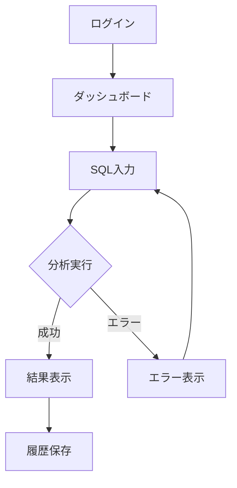

# skanehira/dotfiles 直近1ヶ月の変更解説

**リポジトリ:** https://github.com/skanehira/dotfiles  
**対象期間:** 2024年12月30日〜2025年1月26日頃のコミット（`git log --since=2024-12-30` で取得した範囲）

macOS/Linux 向けの dotfiles リポジトリ。claude / git / karabiner / tmux / vim / wezterm / zsh をモジュール単位で管理している。ここでは直近1ヶ月の変更を**ブロック別**に整理して解説する。

---

## ブロック1: Claude Code スキル・要件定義フローの拡張

**目的:** アイデア→要件→設計→実装の一連のフローをスキルとして追加・整理した。

### 主な変更

| 変更内容 | コミット・ファイル例 |
|----------|----------------------|
| **plan → spec へのリネーム** | `claude/commands/plan.md` → `claude/commands/spec.md`。設計書（DESIGN.md）とタスクリスト（TODO.md）を生成するコマンドとして統一。 |
| **要件定義系スキルの追加・更新** | `analyzing-requirements`、`user-story`、`ui-sketch`、`usecase-description`、`feasibility-check`、`ddd-modeling` を追加・更新。参照用に `references/` 内にテンプレート（design-template, story-guide, usecase-template, jtbd-framework 等）を配置。 |
| **企画・アイデア系スキルの追加** | `ideation`、`problem-definition`、`competitor-analysis`、`slc-ideation` を追加。`/ideation` で problem-definition → competitor-analysis → slc-ideation の流れを実行。 |
| **スキルドキュメントの整備** | `claude/skills/README.md` を追加。開発ワークフロー（アイデア→要件→実装）と主要スキルの対応を明文化。 |
| **その他コマンド・スキル** | `interview` コマンド、`fix-lsp-warnings` スキル・エージェント、`create-skill` コマンドと `creating-rules` / `reviewing-skills`、`writing-tests`（Go/Rust/React 用参照）を追加。 |

### ファイル構成の変化

- **追加:** `claude/skills/README.md`、各スキル配下の `references/*.md`
- **リネーム:** `requirements-analysis` → `analyzing-requirements`、`task-planning` → `planning-tasks`、`development` → `developing`、`skill-reviewer` → `reviewing-skills`
- **削除:** `claude/CLAUDE.md`（ルートの `CLAUDE.md` に集約）

### 要件定義系スキル：具体的な役割とワークフロー

要件・設計フェーズでは **6つのスキル** を順に実行し、`USER_STORIES.md` → `UI_SKETCH.md` → `USECASES.md` → `FEASIBILITY.md` → `GLOSSARY.md` / `MODEL.md` → `DESIGN.md` を生成する。`/requirements` コマンドで一連の流れを実行できる。

| スキル | やっていること | 主な出力 |
|--------|----------------|----------|
| **user-story** | 対話でユーザータイプを特定し、「As a / I want to / So that」形式のストーリーを洗い出し、Given-When-Then の受け入れ基準と MoSCoW/ICE で優先順位付け。INVEST 基準に沿ったセルフレビューをサブエージェントに委譲。 | `docs/USER_STORIES.md` |
| **ui-sketch** | USER_STORIES と PRODUCT_SPEC を前提に、画面一覧・ユーザーフロー図（Mermaid）・ASCII ワイヤーフレームを作成。 | `docs/UI_SKETCH.md` |
| **usecase-description** | ストーリーを正常系・異常系・代替フローに展開し、ビジネスルールを明確化。references の usecase-guide / usecase-template を参照。 | `docs/USECASES.md` |
| **feasibility-check** | ユースケースから技術的不確実性を洗い出し、検証項目・成功基準・PoC 計画を立てる。技術リスクが高い場合に実施。 | `docs/FEASIBILITY.md` |
| **ddd-modeling** | ユースケース・FEASIBILITY・USER_STORIES を元に、質問主導でドメインを探索。用語集（ユビキタス言語）とドメインモデル図（Mermaid）を生成。references の ddd-patterns でエンティティ/値オブジェクト/集約を判定。 | `docs/GLOSSARY.md`, `docs/MODEL.md` |
| **analyzing-requirements** | 上記すべてを読み込み、What/Why/How/When/Who で要件を分析。**仮定を立てず** AskUserQuestion や Grep/Read で不確実性を解消。機能・非機能要件と制約を構造化し、アーキテクチャ・技術選定・データ設計・エラー戦略・テスト戦略を記述。`rules/core/design.md` を参照し、design-template に沿って DESIGN.md を出力。最後にセルフレビュー（完全性・一貫性・実現可能性・明確性・整合性）を最大3回実施。 | `docs/DESIGN.md` |

#### ui-sketch の出力例（`docs/UI_SKETCH.md`）

ui-sketch は **画面一覧**・**ユーザーフロー（Mermaid）**・**ASCII ワイヤーフレーム**・**各画面の要素・インタラクション** を1本のドキュメントにまとめる。スキル内で使われている形式の例は以下のとおり。

**1. 画面一覧（表）**

| 画面名 | 種類 | 説明 |
|--------|------|------|
| ログイン | 認証系 | ユーザー認証 |
| ダッシュボード | メイン | トップページ |
| SQL入力 | メイン機能 | クエリ入力と分析実行 |
| 結果表示 | 結果表示 | 改善案の一覧 |

**2. ユーザーフロー（Mermaid flowchart）**



**3. ワイヤーフレーム（ASCII）**

各画面ごとにボックスとラベルでレイアウトを表現する。例（SQL入力画面）：

```
┌─────────────────────────────────────────┐
│ DBTune                      [user@mail] │
├─────────────────────────────────────────┤
│        │                                │
│ 履歴   │  SQL入力                       │
│ 設定   │  ┌─────────────────────────┐   │
│        │  │ SELECT * FROM users     │   │
│        │  │ WHERE ...               │   │
│        │  │                         │   │
│        │  └─────────────────────────┘   │
│        │                                │
│        │  スキーマ（任意）              │
│        │  ┌─────────────────────────┐   │
│        │  │ CREATE TABLE users ...  │   │
│        │  └─────────────────────────┘   │
│        │                                │
│        │  [分析する]                    │
│        │                                │
└─────────────────────────────────────────┘
```

**4. 各画面の要素・インタラクション**

画面ごとに「要素」リストと「インタラクション」表を記載する。

- **要素**: 入力欄、ボタン、テーブル、メニューなど
- **インタラクション**: トリガー（例: 「分析」ボタンクリック）→ アクション（API呼び出し）→ 結果（ローディング → 結果表示 / エラー表示）

末尾に **デザイン方針（メモ）**（例: シンプルで直感的、ダークモード対応、デスクトップ優先など）を書くこともある。

いずれのスキルも「前提ドキュメントの読み込み → 対話（AskUserQuestion）→ ドキュメント生成 → セルフレビュー」の流れを持ち、既存ファイルがあればスキップや途中開始が可能。

### 企画・アイデア系スキル：具体的な役割とワークフロー

アイデア・企画フェーズでは **3つのスキル** を順に実行し、`PROBLEM_DEFINITION.md` → `COMPETITOR_ANALYSIS.md` → `PRODUCT_SPEC.md` を生成する。`/ideation` コマンドで一括実行できる。

| スキル | やっていること | 主な出力 |
|--------|----------------|----------|
| **problem-definition** | JTBD（Jobs To Be Done）で「どんな状況で何を達成したいか」を言語化。ジョブの3層（機能的・感情的・社会的）と、ペイン（痛み）・ゲイン（得たい価値）を対話で深掘り。ペインは機能的/金銭的/プロセス/サポートに分類し深刻度・頻度を付け、ゲインは必須/期待/望外に整理。ターゲット・非ターゲットのペルソナを明確にし、references の jtbd-framework を参照。最後にサブエージェントで問題定義書をレビュー。 | `docs/PROBLEM_DEFINITION.md` |
| **competitor-analysis** | PROBLEM_DEFINITION を前提に、同一問題を**同じ方法**で解く直接競合と、**異なる方法**（手作業・Excel・外注など）の間接競合を洗い出し。WebSearch で各競合の概要・ターゲット・機能・価格・強み・弱みを収集。ユーザーにとって重要な比較軸で比較表とポジショニングマップ（2軸）を作成し、差別化ポイント（機能/ターゲット/価格/体験/統合）を1〜3個特定。サブエージェントで競合分析書をレビュー。 | `docs/COMPETITOR_ANALYSIS.md` |
| **slc-ideation** | SLC（Simple, Lovable, Complete）でアイデアを壁打ち。**Simple**: 30秒で説明できるか・コア価値1つか・2〜4週間でリリース可能なスコープか。**Lovable**: ターゲットが「これ欲しい」と感じるか・感情的な繋がりと差別化があるか。**Complete**: 限定スコープで「完成」と言えるか・追加開発なしで価値を出し続けられるか。3要素が満たされるまで検証ループを回し、references の slc-framework と product-spec-template に沿ってプロダクト仕様書を生成。サブエージェントでレビュー。 | `docs/PRODUCT_SPEC.md` |

problem-definition → competitor-analysis → slc-ideation の順で、**誰のどんな問題か** → **競合と差別化** → **スコープの固まったプロダクト仕様** まで一気通貫で整理する設計になっている。

---

## ブロック2: Claude コアルール・TDD・設計の整理

**目的:** 言語固有のルールから共通部分を抽出し、コアルールと参照ファイルで再利用できるようにした。

### 主な変更

| 変更内容 | コミット・ファイル例 |
|----------|----------------------|
| **コアルールの新設** | `claude/rules/core/tdd.md`、`core/commit.md`、`core/testing.md`、`core/design.md` を追加。TDD（RED→GREEN→REFACTOR）、Conventional Commit、テスト命名・test-doubles、高凝集・低結合・colocation などを定義。 |
| **Rust 由来の共通化** | Rust 用の design/testing から共通部分を `core/design.md`、`core/testing.md` へ抽出。`backend/rust/` はコアを参照する形に変更。 |
| **バックエンドルールの追加** | `claude/rules/backend/go/`（coding, design, testing）と `backend/rust/` を追加。`claude/install.sh` でルールのシンボリックリンクを配置。 |
| **参照ファイルの整理** | `core/references/test-naming.md`、`test-doubles.md` を追加。重複していた `tdd-guidelines.md`、`must-rules.md` を削除し、スキルからコアルール参照に一本化。 |
| **TDD ルールのパス追記** | `claude/rules/core/tdd.md` にパス（リポジトリ内の関連ファイル）を追加し、Claude が参照しやすくした。 |

### コアルールの新設：具体的な内容

`claude/rules/core/` に置かれた4つのコアルールは、**どの言語でも共通で参照する**前提の設計・開発・テスト・コミットの約束事を定義している。

| ルール | 対象パス | やっていること |
|--------|----------|----------------|
| **tdd.md** | `**/*.go`, `**/*.rs`, `**/*.ts`, `**/*.lua` | Kent Beck の TDD に従い、**RED**（失敗テストを先に書く）→ **GREEN**（最小限の実装）→ **REFACTOR**（テスト通過後にのみ品質改善）を必須化。バグ修正時は「バグを示す失敗テスト → 最小再現テスト → 最小修正」の順を指定。**Tidy First**: 構造的変更（リネーム・抽出・移動・フォーマット）と動作的変更（新機能・バグ修正）を**同じコミットで混ぜない**、構造的を先に行う、と明文化。 |
| **commit.md** | （全般） | コミット条件（全テスト通過・警告解消・単一の論理単位）と **Conventional Commit**（emoji + type + subject、body、Claude Code 署名）。type は feat/fix/docs/style/refactor/test/chore/perf。Tidy First に合わせ **\[STRUCTURAL]** / **\[BEHAVIORAL]** のプレフィックスを推奨。HEREDOC による複数行メッセージの例を記載。 |
| **design.md** | `**/*.go`, `**/*.rs`, `**/*.ts`, `**/*.lua` | **SOLID**・**YAGNI**・命名（曖昧な check/process/handle を避け、戻り値は結果を表す型名）に加え、**高凝集度**（1モジュール1責務・変更理由1つ）、**低結合度**（依存は最小・依存性注入でテスト可能）、**コロケーション**（関連ファイルを機能別ディレクトリにまとめ、テストをソースの近くに配置）を定義。God Component・Prop Drilling・テストの隔離・Feature Envy・Shotgun Surgery をアンチパターンとして列挙。 |
| **testing.md** | `**/*_spec.lua`, `**/*_test.go`, `**/*.rs`, `**/*.test.ts`, `**/*.spec.ts` | テストは**仕様**かつ**セーフティネット**。**振る舞いをテスト**し、実装詳細や設定値のアサーション（トートロジー）を禁止。リトマス試験「失敗したときにユーザーにとって何が壊れたか説明できるか」を明示。テストの独立性・命名（シナリオ_期待挙動）・アサーション（文字列は完全一致、構造体は全体比較）・AAA パターン・パラメータ化の条件を記載。`references/test-naming.md` と `references/test-doubles.md` を参照。 |

これらをコアに据えることで、スキル（analyzing-requirements の design 参照、writing-tests の testing 参照）やバックエンド別ルール（Go/Rust）が「コア + 言語固有」の2層で一貫する構成になっている。

---

## ブロック3: Claude コマンド・エージェント・設定

**目的:** コマンド・エージェントの名前統一、設定の更新、フック・フォーマット連携の強化。

### 主な変更

| 変更内容 | コミット・ファイル例 |
|----------|----------------------|
| **commit-push コマンド** | `claude/commands/commit-push.md` を追加。Conventional Commit 形式でコミット＆プッシュするフローを定義。 |
| **committer → commit-pusher** | `claude/agents/committer.md` を削除し、`commit-pusher.md` にリネーム・簡素化。`commit-push` コマンドから利用。 |
| **impl / review / spec の更新** | `impl.md`、`review.md`、`spec.md` を更新。コアルール（tdd、commit、testing）を参照する記述に変更。マークダウン表のフォーマット調整も実施。 |
| **settings.json の更新** | `CLAUDE_CODE_MAX_OUTPUT_TOKENS` で autocompact サイズを調整、marketplace・gopls・frontend-design・code-simplifier・fix-lsp-warnings・language などの設定を追加・更新。 |
| **planning-tasks の拡張** | `planning-tasks` スキルに CHECK ステップを追加。タスク計画の品質チェックを組み込んだ。 |

---

## ブロック4: Vim（Neovim）AI バッファ・tmux 連携

**目的:** Claude Code 用の AI バッファと tmux ペインの連携を強化し、操作をしやすくした。

### 主な変更

| 変更内容 | コミット・ファイル例 |
|----------|----------------------|
| **AI バッファの改善** | `vim/lua/modules/ai/buffer.lua`、`init.lua` でバッファの開閉・再表示、タブキー送信、Ctrl+V の追加。tmux ペイン未検出時のハンドリングを改善。 |
| **スキル/コマンドのファジー検索** | `vim/lua/modules/ai/complete.lua` を追加。AI バッファからスキル・コマンドファイルをファジー検索して挿入できるようにした。重複表示を削除。 |
| **ペインサイズ** | AI 用 tmux ペインを 40% で作成するように変更（`vim/lua/modules/ai/init.lua`）。 |
| **gyazo.nvim** | スクリーンショット連携用に `vim/lua/plugins/docs/gyazo.lua` を追加。 |

---

## ブロック5: Vim マークダウン・LSP・プラグイン

**目的:** マークダウン編集支援の見直し、LSP の追加、プラグインの差し替え。

### 主な変更

| 変更内容 | コミット・ファイル例 |
|----------|----------------------|
| **マークダウン表の自動フォーマット** | `vim/lua/modules/markdown/table_format.lua` を追加し、保存時にマークダウン表を自動整形。`render-markdown.nvim` を削除し、`vim/lua/plugins/docs/markdown.lua` を table 用に変更。 |
| **ASCII ボックス** | `vim/lua/modules/markdown/ascii_format.lua` を追加。マークダウン用の ASCII ボックス整形モジュール。`autocmd.lua` で紐付け。 |
| **LSP の追加・変更** | oxlint を LSP に追加（`vim/lua/plugins/lsp/mason.lua`）。version-lsp を導入し、crates.nvim を削除。`version_ls.lua` を追加。LSP ソース表示の有効化（`tiny-inline-diagnostic.lua`）。 |
| **Claude 書き出し時のフォーマット** | `claude/hooks/format.ts` で Claude がファイルを書いたときにフォーマットを実行するように変更。 |
| **k8s.nvim** | `k8s.vim` から `k8s.nvim` へ移行（`vim/lua/plugins/infra/k8s.lua`）。コメントアウトの削除。 |
| **その他** | ファイルフルパスコピー用キーマップ（`vim/lua/settings/keymaps.lua`）。`lua_ls.lua` の更新。 |

---

## ブロック6: tmux・Git・その他

**目的:** tmux のキーマップとコピー動作、Git 設定の整理、ライセンス追加。

### 主な変更

| 変更内容 | コミット・ファイル例 |
|----------|----------------------|
| **tmux** | 新規セッション作成用キーマップの追加（`tmux/tmux.conf`）。mac で y コピー時に `copy-pipe` を使うように変更（`tmux.conf.mac`）。`allow-passthrough` の追加（`tmux.conf`）。 |
| **Git** | 不要なエイリアスとコメントの削除（`git/.gitconfig`）。 |
| **LICENSE** | ルートに `LICENSE` を追加（`chore: add LICENSE`）。 |

---

## まとめ

| ブロック | キーワード |
|----------|-------------|
| 1 | スキル拡張、要件定義、ideation、spec、README |
| 2 | コアルール、TDD、design、testing、backend/go, rust |
| 3 | commit-push、commit-pusher、impl/review/spec、settings.json、planning-tasks |
| 4 | AI バッファ、tmux 連携、complete、gyazo.nvim |
| 5 | マークダウン表・ASCII、LSP（oxlint, version-ls）、k8s.nvim、format フック |
| 6 | tmux キーマップ・copy-pipe、Git 整理、LICENSE |

全体として、**Claude Code と Neovim を中心に、スキル・ルール・コマンドの体系化**と、**Vim の AI バッファ・マークダウン・LSP まわりの実用化**が直近1ヶ月のテーマになっている。
